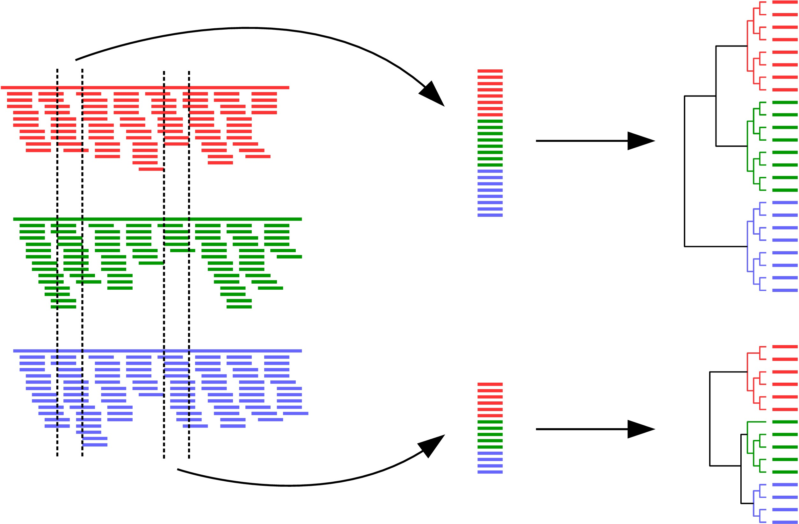

# Phyloscanner
Generating phylogenies between and within hosts at once, in windows along the genome, using mapped reads as input.  
Dependencies: [samtools](http://www.htslib.org/), [pysam](https://github.com/pysam-developers/pysam), [biopython](http://biopython.org/wiki/Download), [mafft](http://mafft.cbrc.jp/alignment/software/) and [RAxML](http://sco.h-its.org/exelixis/web/software/raxml/index.html).  

<p align="center"></p>

### Basic usage:
```bash
$ ./phyloscanner.py MyBamFiles.txt MyRefFiles.txt --windows 1,300,200,500,...
```
where  
1. `MyBamFiles.txt` is a plain text file listing the desired bam input files, one per line;  
2. `MyRefFiles.txt` is a plain text file listing the files containing the sequences to which the short reads were mapped in order to create the bam input files (the *references*), one per bam file, in the same order as in `MyBamFiles.txt`;  
3. the `--windows` option is used to specify an even number of comma-separated positive integers: these are the coordinates of the windows to analyse, interpreted pairwise (i.e. the first two are the left and right edges of the first window, the third and fourth are the left and right edges of the second window, ...) and with respect to the alignment of sequences in `MyRefFiles.txt` (this alignment will be generated and put into a file called `RefsAln.fasta`).  

### What windows should I choose?
I'm glad you asked. It's important. You might as well fully cover the genomic region you're interested in. That requires choosing where to start and where to end. If you're interested in the whole genome, the start is 1 and the end is the genome length, or more precisely the length of the alignment of your references in the bam file (because it is with respect to this alignment that coordinates are interpreted by default; more on the interpretation of coordinates later). In addition, you need to choose how wide each window is, and how much neighbouring windows overlap (with negative overlap understood to mean that there is space in between neighbouring windows). These are a bit more complicated.

Consider the latter - overlap - first. It's probably a good idea to choose the overlap such that each window is independent, or nearly independent, of its neighbours. That is achieved by choosing the overlap and the window width together such that the distance from the start of one window to the end of the next exceeds the read length: that way no read can span two windows. This would be unambiguous if you only had one bam file, or if every bam file used exactly the same reference for mapping. With multiple references however, window coordinates need to be interpreted with respect to different references (the default interpretation being the alignment of references as mentioned). If one reference has a deletion inside a particular window, then the window width becomes smaller for that reference for that window. That would mean that if you choose windows & overlaps so that any given read is *only just unable* to fully span two neighbouring windows, such a deletion could TODO: continue writing here...

NB wherever *read* and *read length* appeared in the discussion above, they should be substituted for *insert* and *insert size* if you have paired-read data AND the reads in a pair overlap AND you run phyloscanner with the option to merge overlapping paired reads into a single longer read.
