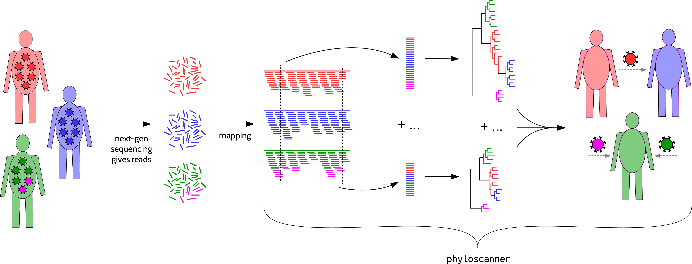
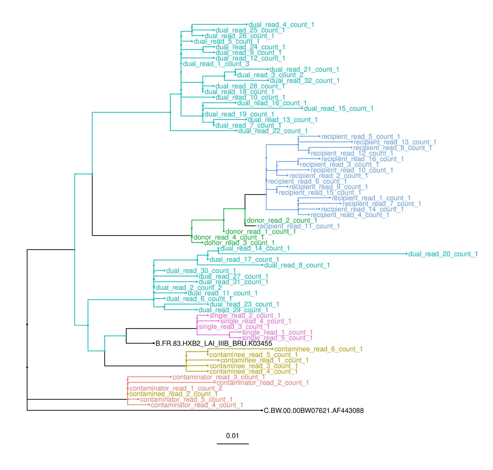
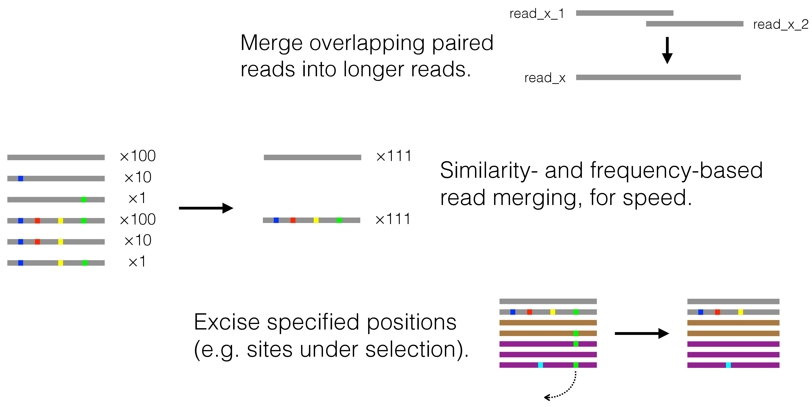

# phyloscanner
Analysing pathogen genetic diversity and relationships between and within hosts at once, in windows along the genome.  

<p align="center"></p>

phyloscanner's input is bam files: reads (fragments of nucleotide sequence) that have been mapped (aligned) to the correct part of some reference genome.
We wrote phyloscanner to analyse bam files that each represent a pathogen population in one host, exhibiting within-host and between-host diversity; in general use each bam file should be a sample representing some subpopulation, and we analyse within- and between-sample diversity.  

The phyloscanner manual is [here](InfoAndInputs/PhyloscannerManual.pdf).  
phyloscanner is freely available under the GNU General Public License version 3, described [here](LICENSE).  
To make phylogenies from mapped reads, phyloscanner requires [samtools](http://www.htslib.org/), [pysam](https://github.com/pysam-developers/pysam) (0.8.1 or later), [biopython](http://biopython.org/wiki/Download), [mafft](http://mafft.cbrc.jp/alignment/software/) and [RAxML](http://sco.h-its.org/exelixis/web/software/raxml/index.html); notes on installing these are [here](InfoAndInputs/DependencyInstallationNotes.txt).
To analyse these phylogenies, or your own provided as input, phyloscanner needs some R packages which are installed by running [this](tools/PackageInstall.R) script.

### An Example

The simulated bam files in [ExampleInputData](ExampleInputData) illustrate interesting within- and between-host diversity.
To make some within- & between-host phylogenies, run this command from the directory where your local copy of this code repostory lives (or adjusting paths appropriately if run from another directory):
```bash
$ cd ExampleInputData
$ ../phyloscanner_make_trees.py InputFileList.csv --windows 1000,1300,2000,2300,3000,3300,4000,4300,5000,5300,6000,6300,7000,7300,8000,8300 -A ../InfoAndInputs/2refs_HXB2_C.BW.fasta --pairwise-align-to B.FR.83.HXB2_LAI_IIIB_BRU.K03455 
```
(Those windows make best use of this simulated data, the `-A` option includes an alignment of extra reference sequences along with the reads, see the manual for the `--pairwise-align-to` option.)  
Now let's analyse those phylogenies:
```bash
$ ../phyloscanner_analyse_trees.R RAxMLfiles/RAxML_bestTree. MyOutput s,1 --outgroupName C.BW.00.00BW07621.AF443088
```
In the output you'll see trees and summary information indicating that these samples constitute:
* a straightforward, singly infected individual, 
* a dually infected individual i.e. infected by two distinct strains of virus,
* a contamination pair (one contaminating the other), and
* a pair exhibiting *ancestry*, i.e. one having evolved from the other. For populations of pathogens, this implies transmission, either indirectly (via unsampled intermediate patients) or directly.

Here is one of the trees from the output.
Each patient has many sequences (reads), with one colour per patient.
Extra reference sequences and any reads phyloscanner decides it should ignore are coloured black.
Can you see why each of the patients merits their label?

<p align="center"></p>

(These bam files were generated by taking HIV sequences from the [LANL HIV database](https://www.hiv.lanl.gov/content/sequence/NEWALIGN/align.html), using them as starting points for  evolution simulated with [SeqGen](https://github.com/rambaut/Seq-Gen) and calibrated to our own real data on within-host diversity.
Reads were then generated in eight windows of the genome - those specified with the `--windows` option in the command above - instead of all along the genome, purely to keep file sizes nice and small while remaining an interesting example.)

### I've only got *raw* reads fresh off the sequencing machine, not *mapped* reads. Any recommendations on how to map?
Why yes!
For HIV at least, try [shiver](https://github.com/ChrisHIV/shiver).
We discussed [here](http://biorxiv.org/content/early/2016/12/09/092916) problems and solutions for mapping well in general.

### Some more pictures
Here are some cartoons of the `--merge-paired-reads`, `--merging-threshold` and `--excision-coords` options in action:

<p align="center"></p>

