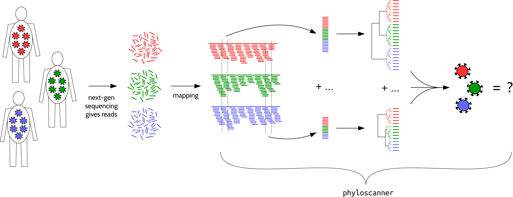

# Phyloscanner
Generating phylogenies between and within hosts at once, in windows along the genome, using mapped reads as input.  
Dependencies: [samtools](http://www.htslib.org/), [pysam](https://github.com/pysam-developers/pysam), [biopython](http://biopython.org/wiki/Download), [mafft](http://mafft.cbrc.jp/alignment/software/) and [RAxML](http://sco.h-its.org/exelixis/web/software/raxml/index.html).  

<p align="center"></p>

### Basic usage:
```bash
$ ./phyloscanner.py bams.txt refs.txt --windows 1,300,200,500,...
```
where  
1. `bams.txt` is a plain text file listing the desired bam files, one per line;  
2. `refs.txt` is a plain text file listing the files containing the sequences to which the short reads were mapped in order to create the bam files (the *references*), one per bam file, in the same order as in `bams.txt`;  
3. the `--windows` option is used to specify an even number of comma-separated positive integers: these are the coordinates of the windows to analyse, interpreted pairwise, i.e. the first two are the left and right edges of the first window, the third and fourth are the left and right edges of the second window, ... i.e. in the above example we have windows 1-300, 200-500, ...  
Details of optional arguments of phyloscanner can be seen by using the `--help` option, or seeing the section *Phyloscanner options* below.  
We use phyloscanner with bam files that each represent a pathogen population (HIV, specifically) in one host, exhibiting within-host and between-host diversity; in more general use each bam file is a sample representing some subpopulation, and we can talk about within- and between-sample diversity.

### What windows should I choose?
I'm glad you asked. It's important. You might as well fully cover the genomic region you're interested in. That requires choosing where to start and where to end. If you're interested in the whole genome, the start is 1 and the end is the genome length, or more precisely the length of an alignment of the references in the bam files (this alignment is generated by phyloscanner, and it is with respect to this alignment that coordinates are interpreted by default; more on this later).  
If your reads were generated by amplifying the sample using primers, the primers should have been trimmed from the reads as part of whatever bioinformatic pipeline produced your input bam files. (This can be done for example using [Fastaq](https://github.com/sanger-pathogens/Fastaq), which is called as part of the [shiver](https://github.com/ChrisHIV/shiver) pipeline.)
Then a sensible choice for the start of the first window would be the first position *after* the first primer, and a sensible choice for the end of the last window would be the last position *before* the last primer.

In addition, you need to choose how wide each window is, and how much neighbouring windows overlap (with negative overlap understood to mean that there is space in between neighbouring windows). These are a bit more complicated.

Window width first. If a window is very small, so little diversity is contained inside it (within or between samples) that the number of *unique* reads overlapping the window is small, hindering meaningful phylogenetics. If window width exceeds read length, then you will have no reads in the window, since we keep only reads fully overlapping the window. Somewhere between these two extremes therefore maximises the number of unique reads; to help you figure out what that is for your data, you can run phyloscanner with the `--explore-window-widths` option. This reports, for each in a list of window widths to try, how many unique reads are found for each bam and at each position along the genome. To summarise these read counts into a single value that varies with window width, you could use the mean, or the median; or you might be interested in a percentile lower than the 50th, if your concern is ensuring some minimal amount of diversity across all bams and all genomic positions. Up to you.  
(Note that some of the other options can affect how many reads you get in a window and so can affect what `--explore-window-widths` will tell you, namely the `--excision-coords`, `--merging-threshold`, `--min-read-count`, `--quality-trim-ends`, `--min-internal-quality`, and `--discard-improper-pairs` options. The first two can result in two or more unique reads being merged into one; the rest can simply discard some reads. You could choose values for the associated parameters immediately and then use `--explore-window-widths`, or else come back to `--explore-window-widths` later on once you've got the hang of phyloscanner and investigated the effect of those other options in your data.)  
NB power users might want to optimise their own measure of phylogenetic information as a function of window width; one of the first metrics to pop into your head might be the mean bootstrap of all nodes in the tree. That's not advised because within a sample there may be many very similar sequences, and the set of nodes connecting these may have poor boostrap support, but this is not something that ought to be penalised. Also in theory you might be able to increase the window width until only a single read is found spanning the window in each patient; your bootstraps might then be great - between-host diversity is greater than that within-host - but you've thrown out all the within-host information.

Now overlap. It's probably a good idea to choose the overlap such that each window is independent of its neighbours, because if you have sliding windows that only shift by one base each time, you're redoing calculations and analysis for virtually the same data again and again. Independent windows can be achieved trivially by having zero overlap or negative overlap (i.e. space) between neighbouring windows. But you might want windows to overlap so that you can fit more windows into the same space. In that case, independency of windows can be achieved non-trivially by choosing the overlap such that the distance from the start of one window to the end of the next exceeds the read length: that way no read can span two windows and get counted twice. This would be unambiguous if you only had one bam file, or if every bam file used exactly the same reference for mapping. With multiple references however, window coordinates need to be interpreted with respect to different references. If one reference has a deletion inside a particular window, then the window width is smaller for that reference for that window. So, if your window width & overlap is such that reads are *only just unable* to fully span two neighbouring windows, a small deletion could make some reads *only just able* to fully span two neighbouring windows. (The fraction of such reads will be small if coverage is uniform around the two windows.) If you decrease the overlap so that the distance from the start of one window to the end of the next window is somewhat larger than read length, a correspondingly larger deletion would be required inside those two windows to allow any reads to fully span them. However decreasing the overlap also decreases the total number of windows you can fit in. To balance this you have to decide how much you care if, for one of many bam files and for one of many positions along the genome, one of many reads overlaps two neighbouring windows and so provides sequence data to both.

NB wherever *read* and *read length* appeared in the discussion above, they should be substituted for *insert* and *insert size* if you have paired-read data AND the reads in a pair sometimes overlap AND you run phyloscanner with `--merge-paired-reads` to merge overlapping paired reads into a single longer read (see the cartoon below). A complication with this is that whereas read length is typically fixed within a sample, insert size has a distribution of different values. A window which is wider than twice the read length can never get any reads, because the reads in a pair need to overlap in order to be merged. So you have two choices.  
1. Choose  
(read length) < (window width) < (twice the read length)  
Then you're restricted to the subset of read pairs that satisfy  
(window width) <= (insert size) < (twice the read length)  
because only such pairs can overlap and fully span the window. The fraction of such reads in a sample is the integral of the unit-normalised insert size distribution between the two limits in the inequality above.  
2. Choose  
(window width) <= (read length)  
Then you can have single reads contribute in addition to merged overlapping read pairs. But perhaps that window is too short; see the window-width discussion above.


### Interpreting window coordinates
By default the references used for mapping (to produce the bam files), together with an extra set of references if specified with `--alignment-of-other-refs`, are all aligned together and window coordinates are interpreted with respect to the alignment (i.e. position *n* refers to the *n*th column of that alignment, which could be a gap for some of the sequences). This alignment can be found in the file `RefsAln.fasta` after running phyloscanner, should you want to inspect it and possibly run again. You can manually specify window coordinates with respect to this alignment, using the `--windows` option, or have windows automatically chosen using `--auto-window-params`, which attempts to minimise the affect of insertions and deletions in the references on your window width and overlap preferences.  
Alternatively, if you are using the `--alignment-of-other-refs` option to include extra references, you can use `--pairwise-align-to` to name one of these references to be a kind of *reference reference*: instead of aligning of all the bam file references to each other, they will be sequentially and separately pairwise-aligned to your named reference, and window coordinates are interpreted with respect to that named reference.
Using the `--pairwise-align-to` option is expected to more stable than `--windows` or `--auto-window-params` if your bam file references are many and diverse, since pairwise alignment is easier than multiple sequence alignment.
It also has the advantage that when running phyloscanner more than once with different bam files, the coordinates mean the same thing each time.

### Some more pictures
Here are some cartoons of the `--merge-paired-reads`, `--merging-threshold` and `--excision-coords` options in action:

<p align="center"></p>

### Phyloscanner options
```
  -h, --help            show this help message and exit
  -W WINDOWS, --windows WINDOWS
                        A comma-separated series of paired coordinates
                        defining the boundaries of the windows. e.g.
                        1,300,11,310,21,320 would define windows 1-300,
                        11-310, 21-320.
  -AW AUTO_WINDOW_PARAMS, --auto-window-params AUTO_WINDOW_PARAMS
                        Used to specify 2, 3 or 4 comma-separated integers
                        controlling automatic window finding. The integer is
                        the width you want windows to be, weighting each
                        column in the alignment of bam file references (plus
                        any extra references included) by its non-gap
                        fraction. The second is the overlap between the end of
                        one window and the start of the next (which can be
                        negative). The optional third integer is the start
                        position for the first window (by default, 1). The
                        optional fourth integer is the end position for the
                        last window (by default, windows will continue up to
                        the end of the alignment of references).
  -A ALIGNMENT_OF_OTHER_REFS, --alignment-of-other-refs ALIGNMENT_OF_OTHER_REFS
                        An alignment of any reference sequences (which need
                        not be those used to produce the bam files) to be cut
                        into the same windows as the bam files and included in
                        the alignment of reads (e.g. to help root trees).
  -AO, --align-refs-only
                        Align the references in the bam files (plus any extras
                        specified with -A) then quit without parsing the
                        reads.
  -C CONTAMINANT_COUNT_RATIO, --contaminant-count-ratio CONTAMINANT_COUNT_RATIO
                        Used to specify a numerical value which is interpreted
                        the following way: if a sequence is found exactly
                        duplicated between any two bam files, and is more
                        common in one than the other by a factor at least
                        equal to this value, the rarer sequence is diagnosed
                        as contamination. It does not go into the tree, and
                        instead goes into a contaminant read fasta file.
  -CD CONTAMINANT_READ_DIR, --contaminant-read-dir CONTAMINANT_READ_DIR
                        A directory containing the contaminant read fasta
                        files produced by a previous run of phyloscanner.py
                        using the the -C flag: reads flagged as contaminants
                        there will be considered contaminants in this run too.
                        The windows must exactly match up between these two
                        runs, most easily achieved with the -2 option. The
                        point of this option is to first do a run with every
                        bam file you have in which there could conceivably by
                        cross-contamination, using the -C flag (and possibly
                        -CO to save time), and then in subsequent runs
                        focussing on subsets of bam files you will be able to
                        identify contamination from outside that subset.
  -CE, --recover-clipped-ends
                        The default behaviour of phyloscanner is to keep only
                        reads that are mapped across both edges of the window
                        in question. A read which is long enough to reach the
                        edge of the window but is not mapped at its end, i.e.
                        the end is clipped, will therefore not be included.
                        With this option, clipped ends are recovered by
                        considering any bases at the ends of the read that are
                        unmapped to be mapped instead to 1 more than the base
                        to their left (at the right end) or 1 less than the
                        base to their right (at the left end), iterating out
                        from the centre. e.g. a 9bp read mapped to positions
                        None,None,10,11,13,14,None,None,None (i.e. clipped on
                        the left by 2bp, and on the right by 3bp, with a 1bp
                        deletion in the middle), is taken to be mapped instead
                        to positions 8,9,10,11,13,14,15,16,17. In this
                        example, if the window left edge is 8 or 9 and the
                        right edge is 15, 16 or 17, the read with its clipped
                        ends recovered spans the window but the read without
                        clipped ends does not. WARNING: mapping software clips
                        the ends of reads for a reason, namely that that
                        stretch of sequence does not look anything like the
                        reference at that point. The clipped sequence could be
                        just junk, or genuine sample from a distant part of
                        the genome (i.e. the read is chimeric); in this case
                        the clipped sequence should be discarded. As such,
                        this option should not be used as part of normal
                        phyloscanner usage. Its intended usage is specifically
                        the following: you have identified a window in a bam
                        file in which reads are clipped, but you believe the
                        reads to be correct, i.e. the clipping is an artefact
                        of the mapper being unable to find the correct local
                        alignment. You should combine this option with --no-
                        trees because the inclusion of clipped sequence, which
                        by definition is very different, increases the chance
                        of misalignment. You should inspect the aligned reads
                        manually before doing anything else (and hopefully get
                        some insight into how the reference in this window
                        should be changed in order to have subsequent
                        remapping get the local alignment right, in particular
                        by contrasting the reference with the consensus of the
                        aligned reads).
  -CO, --flag-contaminants-only
                        For each window, just flag contaminant reads then move
                        on (without aligning reads or making a tree). Only
                        makes sense with the -C flag.
  -D, --dont-check-duplicates
                        Don't compare reads between samples to find duplicates
                        - a possible indication of contamination. (By default
                        this check is done.)
  -E EXPLORE_WINDOW_WIDTHS, --explore-window-widths EXPLORE_WINDOW_WIDTHS
                        Use this option to explore how the number of unique
                        reads found in each bam file in each window, all along
                        the genome, depends on the window width. After this
                        option specify a comma-separated list of integers. The
                        first integer is the starting point for stepping along
                        the genome, in case you're not interested in the very
                        beginning. The second integer is the width spanned by
                        two neighbouring windows; this sets the overlap for
                        each window width though the equation (two-window
                        width) = 2x(window width) - (overlap between windows),
                        with negative overlap understood to mean space between
                        the end of one window and the start of the next.
                        Subsequent integers are window widths to try. For
                        example, if you specified 1000,301,101,151,201 we
                        would count the number of unique reads in windows
                        1000-1100, 1200-1300, 1400-1500, ... and in 1000-1150,
                        1150-1300, 1300-1450 ... and in 1000-1200, 1100-1300,
                        1200-1400, ... where the dots denote continuation to
                        the end of the genome. (Note that both end coordinates
                        of the window are included, hence why 1000-1100 has
                        width 101.) Output is written to the file specified
                        with the --explore-window-width-file option.
  -EF EXPLORE_WINDOW_WIDTH_FILE, --explore-window-width-file EXPLORE_WINDOW_WIDTH_FILE
                        Used to specify an output file for window width data,
                        when the --explore-window-widths option is used.
                        Output is in in csv format.
  -F RENAMING_FILE, --renaming-file RENAMING_FILE
                        Specify a file with one line per bam file, showing how
                        reads from that bam file should be named in the output
                        files. (By default, each bam file's basename is used.)
  -I, --discard-improper-pairs
                        For paired-read data, discard all reads that are
                        improperly paired: in the wrong orientation, or one
                        mate unmapped, or too far apart (as flagged at the
                        time of mapping).
  -IO, --inspect-disagreeing-overlaps
                        When read pairs are merged, those pairs that overlap
                        but disagree are discarded. With this option, these
                        discarded pairs are written to a bam file (one per
                        patient, with their reference file copied to the
                        working directory) for your inspection.
  -MT MERGING_THRESHOLD, --merging-threshold MERGING_THRESHOLD
                        Reads that differ by a number of bases equal to or
                        less than this are merged, following the algorithm in
                        MergeSimilarStrings.py. The default value of 0 means
                        there is no merging.
  -MC MIN_READ_COUNT, --min-read-count MIN_READ_COUNT
                        Reads with a count less than this value (after
                        merging, if merging is being done) are discarded. The
                        default value of 1 means all reads are kept.
  -N NUM_BOOTSTRAPS, --num-bootstraps NUM_BOOTSTRAPS
                        The number of bootstraps to be calculated for RAxML
                        trees (by default, none i.e. only the ML tree is
                        calculated).
  -Ns BOOTSTRAP_SEED, --bootstrap-seed BOOTSTRAP_SEED
                        The random-number seed for running RAxML with
                        bootstraps. The default is 1.
  -O, --keep-overhangs  Keep the whole read. (By default, only the part of the
                        read inside thewindow is kept, i.e. overhangs are
                        trimmed.)
  -P, --merge-paired-reads
                        Merge overlapping paired reads into a single read.
  -Q1 QUALITY_TRIM_ENDS, --quality-trim-ends QUALITY_TRIM_ENDS
                        Each end of the read is trimmed inwards until a base
                        of this quality is met.
  -Q2 MIN_INTERNAL_QUALITY, --min-internal-quality MIN_INTERNAL_QUALITY
                        Discard reads containing more than one base of a
                        quality below this parameter. If used in conjuction
                        with the --quality-trim-ends option, the trimming of
                        the ends is done first.
  -RR REF_FOR_ROOTING, --ref-for-rooting REF_FOR_ROOTING
                        Used to name a reference (which must be present in the
                        file you specify with -A) to be an outgroup in the
                        tree.
  -RC REF_FOR_COORDS, --ref-for-coords REF_FOR_COORDS
                        The coordinates are to be interpreted with respect to
                        (an ungapped version of) the reference named after
                        this flag, which must be present in the file you
                        specify with -A. (By default coordinates are
                        interpreted with respect to the alignment of all bam
                        and external references.) Deprecated; the --pairwise-
                        align-to option is expected to perform better.
  -T, --no-trees        Generate aligned sets of reads for each window then
                        quit without making trees.
  -XC EXCISION_COORDS, --excision-coords EXCISION_COORDS
                        Used to specify a comma-separated set of integer
                        coordinates that will be excised from the aligned
                        reads. Useful for sites of non-neutral evolution.
                        Requires the -XR flag.
  -XR EXCISION_REF, --excision-ref EXCISION_REF
                        Used to specify the name of a reference (which must be
                        present in the file you specify with -A) with respect
                        to which the coordinates specified with -XC are
                        interpreted.
  -2 PAIRWISE_ALIGN_TO, --pairwise-align-to PAIRWISE_ALIGN_TO
                        Sequentially, and separately, align the bam file
                        references to this reference (which must be present in
                        the file you specify with -A) instead of aligning all
                        references together. Window coordinates will be
                        interpreted with respect to this reference.
  --output-dir OUTPUT_DIR
                        Used to specify the name of a directory (which should
                        not exist already) in which all intermediate and
                        output files will be created.
  --time                Prints the times taken by different steps.
  --x-raxml X_RAXML     The command required to invoke RAxML. You may include
                        RAxML options in this command, which need to separated
                        by white space as usual and then the whole thing needs
                        to be surrounded with one pair of quotation marks (so
                        that the raxml binary and its options are kept
                        together as one option for phyloscanner). If you
                        include a path to your raxml binary (necessary if it
                        is not in the $PATH variable of your terminal), it may
                        not include whitespace, since whitespace is
                        interpreted as separating raxml options. The default
                        is 'raxmlHPC-AVX -m GTRCAT -p 1', where -m specifies
                        an evolutionary model and -p specifies a random number
                        seed for the parsimony inferences. If changing from
                        the default, note that the -m and -p options are
                        compulsory. Do not include in this command options
                        relating to bootstraps: use phyloscanner's --num-
                        bootstraps and --bootstrap-seed options instead. Do
                        not include options relating to the naming of files.
  --x-mafft X_MAFFT     The command required to invoke mafft (by default:
                        mafft).
  --x-samtools X_SAMTOOLS
                        The command required to invoke samtools, if needed (by
                        default: samtools).

```
