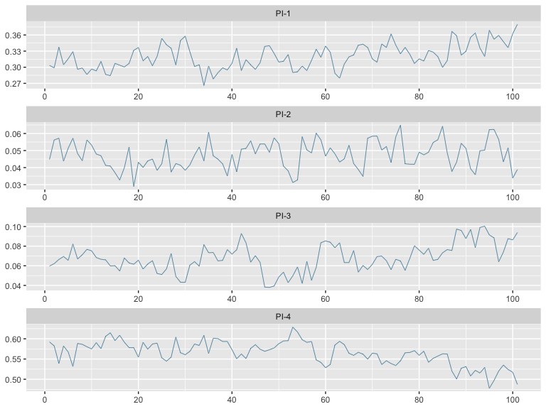

02 - Very first example
================
2019-04-30

Here is a very first example data set for you to have a go at. Please
read the sections “Our Job” and “Our Solution” on the main page before
you go ahead here.

# Input data

**phyloflows** expects input data in a specific format. First, a
data.frame of observed transmission counts within and between population
groups, which we call `dobs`. Second a data.frame that summarises prior
information on how population groups were sampled, which we call
`dprior`.

To get you started, **phyloflows** comes with a small simulated example
data set of transmission counts and sampling information between two
population groups, denoted by “1” and “2”:

``` r
require(phyloflows)
require(ggplot2)
require(bayesplot)
require(data.table)
require(coda)

data(twoGroupFlows1, package="phyloflows")
dobs <- twoGroupFlows1$dobs
dprior <- twoGroupFlows1$dprior
```

## Input data: observed transmission flows

``` r
dobs
#>    REC_TRM_CATEGORY TR_TRM_CATEGORY TR_SAMPLING_CATEGORY
#> 1:                1               1                    1
#> 2:                2               1                    1
#> 3:                1               2                    2
#> 4:                2               2                    2
#>    REC_SAMPLING_CATEGORY TRM_OBS TRM_CAT_PAIR_ID
#> 1:                     1     139               1
#> 2:                     2      15               2
#> 3:                     1      20               3
#> 4:                     2     129               4
```

Data.frame `dobs` must contain the columns *TR\_TRM\_CATEGORY*,
*REC\_TRM\_CATEGORY*, *TRM\_CAT\_PAIR\_ID*, and *TRM\_OBS*. Each row
specifies observed counts of transmissions from a transmitter group to a
recipient group. Each combination of transmission flows is given an ID,
and that ID is stored in *TRM\_CAT\_PAIR\_ID*. `dobs` also must contain
the columns *TR\_SAMPLING\_CATEGORY* and *REC\_SAMPLING\_CATEGORY*,
which associate each transmitter/recipient group with a sampling
category. We will get to this in a minute. For now, let us look at the
data.frame. The first row contains counts of transmission flows from
group “1” to group “1”, and there are 139 of them. The next row contains
counts of transmission flows from group “1” to group “2”, and there are
15 of them. Here is a barplot of our input data:


## Input data: sampling information

Each transmitter/recipient group is associated to a sampling category.
This can be “sampling group a” for both “1” and “2”, or “a” and “b”
respectively for “1” and “2”. In our little data set, we gave the same
name to transmitter/recipient and sampling groups. Data.frame `dprior`
specifies the probability of sampling an individual from each sampling
group. To keep this as flexible as possible, samples from the sampling
distribution, rather than say the mean and standard deviation, need to
be given. Data.frame `dprior` must contain the columns
*SAMPLING\_CATEGORY*, *SAMPLE*, *P* and *LP*. *SAMPLING\_CATEGORY*
specifies the sampling group; *SAMPLE* is just an ID specifying if it is
the first, second, … sample; *P* is the value of the sample, and *LP* is
the log density of the sample.

``` r
head(dprior)
#>    SAMPLING_CATEGORY         P SAMPLE       LP
#> 1:                 1 0.5824160      1 2.318750
#> 2:                 1 0.6184042      2 2.168504
#> 3:                 1 0.6033518      3 3.548540
#> 4:                 1 0.6015475      4 3.585452
#> 5:                 1 0.5918721      5 3.321375
#> 6:                 1 0.6034198      6 3.546614
```

Here is a histogram of the sampling distribution from sampling groups
“1” and “2”. Notice that in our example, the probability of sampling
individuals in group “1” is higher than that among individuals in group
“2”.


# phyloflows MCMC algorithm

## MCMC: syntax

Now that we understand the input data, we are ready to estimate the
transmission flows within and between the two population groups, \[
\pi=(\pi_{11}, \pi_{12}, \pi_{21}, \pi_{22}).
\] We just need to specify a seed, number of iterations of the Markov
Chain Monte Carlo algorithm, a flag for verbose output, and an output
file name if you like to have the results written to an *.rda* file.

``` r
control <- list(seed=42, mcmc.n=500, verbose=0)
ans <- phyloflows:::source.attribution.mcmc(dobs, dprior, control)
#> 
#> Setting seed to 42
#> Number of parameters:     17
#> Dimension of PI:  4
#> Sweep length:     5
#> Number of sweeps:     100
#> Number of iterations:     500
#> Number of transmission pair categories updated per iteration, and their frequencies:
#> 
#> 2 
#> 4 
#> 
#> Sweeps done:  100
```

## MCMC: messages

Let s have a look at the messages first.

  - The total number of unknown parameters in **phyloflows** MCMC is the
    length of \(\pi\) plus the length of the latent transmission flows
    \(z\) plus the length of the pairwise sampling probabilities
    \(\xi\), \(\xi_{ij}=s_i*s_j\), plus twice the length of the sampling
    probabilities \(s\), plus 1 for \(Z\). This makes \(4+4+4+2*2+1=17\)
    in our very first example.
  - The MCMC updates all these parameters in a certain number of MCMC
    iterations, and this number is called a sweep. A sweep is always
    twice the length of the sampling probabilities plus 1 for updating
    the values of \(\pi\). This makes \(2*2+1\) in our very first
    example.
  - The total number of sweeps is determined from `control[['mcmc.n']]`.
    In our case, it is \(50/5=10\). If we had set
    `control[['mcmc.n']]<- 51`, then the total number of sweeps would
    have been \(11\).
  - The total number of iterations is the length of a sweep times the
    total number of sweeps. In our example, \(5*10=50\). If we had set
    `control[['mcmc.n']]<- 51`, then the total number of iterations
    would have been \(5*11=55\).
  - Finally, we have the number of transmission pair categories updated
    per iteration. These numbers are important to assess the likely
    performance of the MCMC. The algorithm proceeds by updating the
    sampling probabilities for the transmitter groups, then those for
    the recipient groups, and finally one update for the values of
    \(\pi\). If we update \(s_1\) for the transmitter groups, we also
    need to update all pairwise sampling probabilities that contain
    \(s_1\) for the transmitter groups. These are \(\xi_{11}=s_1*s_1\)
    and \(\xi_{12}=s_1*s_2\), so we have two pairwise sampling
    probabilities to update. In our very first example, this is always
    the case: if we update any of the 4 \(s_i\) for either the
    transmitter and recipient groups, we always have to update 2
    pairwise sampling probabilities. This is what you see printed,
    before the algorithm gets cranking. In general, the fewer pairwise
    sampling probabilities need to be updated, the better, because the
    MCMC acceptance rates take a huge hit when many parameters need to
    be updated at once. Set up your model so that you have at most 4-6
    joint parameter updates at any MCMC iteration.

## MCMC: output

Let us have a look at the output:

``` r
str(ans)
#> List of 12
#>  $ with.sampling: logi TRUE
#>  $ time         : 'difftime' num 0.322429180145264
#>   ..- attr(*, "units")= chr "secs"
#>  $ dlu          :Classes 'data.table' and 'data.frame':  4 obs. of  3 variables:
#>   ..$ WHO              : Factor w/ 2 levels "TR_SAMPLING_CATEGORY",..: 1 1 2 2
#>   ..$ SAMPLING_CATEGORY: num [1:4] 1 2 1 2
#>   ..$ UPDATE_ID        : int [1:4] 1 2 3 4
#>   ..- attr(*, ".internal.selfref")=<externalptr> 
#>   ..- attr(*, "sorted")= chr "UPDATE_ID"
#>  $ dl           :Classes 'data.table' and 'data.frame':  8 obs. of  4 variables:
#>   ..$ WHO              : Factor w/ 2 levels "TR_SAMPLING_CATEGORY",..: 1 1 1 1 2 2 2 2
#>   ..$ SAMPLING_CATEGORY: num [1:8] 1 1 2 2 1 1 2 2
#>   ..$ UPDATE_ID        : int [1:8] 1 1 2 2 3 3 4 4
#>   ..$ TRM_CAT_PAIR_ID  : int [1:8] 1 2 3 4 1 3 2 4
#>   ..- attr(*, ".internal.selfref")=<externalptr> 
#>   ..- attr(*, "sorted")= chr "UPDATE_ID"
#>  $ dlt          :Classes 'data.table' and 'data.frame':  4 obs. of  4 variables:
#>   ..$ TRM_CAT_PAIR_ID: int [1:4] 1 2 3 4
#>   ..$ TR_UPDATE_ID   : int [1:4] 1 1 2 2
#>   ..$ REC_UPDATE_ID  : int [1:4] 3 4 3 4
#>   ..$ TRM_OBS        : int [1:4] 139 15 20 129
#>   ..- attr(*, ".internal.selfref")=<externalptr> 
#>   ..- attr(*, "sorted")= chr "TRM_CAT_PAIR_ID"
#>  $ nprior       : int 1000
#>  $ sweep        : int 5
#>  $ nsweep       : num 100
#>  $ n            : num 500
#>  $ pars         :List of 9
#>   ..$ LAMBDA: num [1, 1:4] 0.2 0.2 0.2 0.2
#>   ..$ XI    : num [1:101, 1:4] 0.603 0.603 0.591 0.591 0.591 ...
#>   ..$ XI_LP : num [1:101, 1:4] 3.56 3.56 3.24 3.24 3.24 ...
#>   ..$ S     : num [1:101, 1:4] 0.368 0.368 0.36 0.355 0.355 ...
#>   ..$ S_LP  : num [1:101, 1:4] 6.74 6.74 6.42 6.82 6.82 ...
#>   ..$ Z     : int [1:101, 1:4] 366 366 381 361 361 345 345 333 333 333 ...
#>   ..$ NU    : num 1102
#>   ..$ N     : int [1:101, 1] 1226 1113 1183 1113 1104 1088 1100 1154 1108 1108 ...
#>   ..$ PI    : num [1:101, 1:4] 0.303 0.299 0.337 0.305 0.316 ...
#>  $ it.info      :Classes 'data.table' and 'data.frame':  501 obs. of  7 variables:
#>   ..$ IT       : int [1:501] 0 1 2 3 4 5 6 7 8 9 ...
#>   ..$ PAR_ID   : int [1:501] 0 1 2 3 4 NA 1 2 3 4 ...
#>   ..$ BLOCK    : chr [1:501] "INIT" "S-Z-N" "S-Z-N" "S-Z-N" ...
#>   ..$ MHRATIO  : num [1:501] 1 0.012701 1 0.000414 0.000642 ...
#>   ..$ ACCEPT   : int [1:501] 1 0 1 0 0 1 1 1 0 0 ...
#>   ..$ LOG_LKL  : num [1:501] -26.7 -26.7 -23.5 -23.5 -23.5 ...
#>   ..$ LOG_PRIOR: num [1:501] 29 29 35.2 35.2 35.2 ...
#>   ..- attr(*, ".internal.selfref")=<externalptr> 
#>  $ curr.it      : int 501
```

We are mostly interested in the joint posterior distribution \[
p(\pi | n ),
\] which is just a component of the entire posterior distribution of all
parameters \[
p(\pi, z, Z, \xi, s | n ).
\]

So let us look at just this component in the output, and make a trace
plot:

``` r
post.pi <- ans[['pars']][['PI']]
colnames(post.pi) <- paste0('PI-',1:ncol(post.pi))
bayesplot:::mcmc_trace(post.pi, pars=colnames(post.pi), facet_args = list(ncol = 1), n_warmup=0)
```


Ok, fab. Of course we would like many more iterations, perhaps
\(10,000\) sweeps are a good number. We can do that. But what really are
*PI-1*, *PI-2*, *PI-3*, *PI-4*? The numbers 1-4 are just the values of
the transmission pair IDs in `dobs`, `dobs$TRM_CAT_PAIR_ID`. So we can
associate more interpretable names to the output as follows:

``` r
post.pi <- ans[['pars']][['PI']]
setkey(dobs, TRM_CAT_PAIR_ID) #order by pair IDs
post.pi.colnames <- paste0('PI ',dobs$TR_TRM_CATEGORY,'->',dobs$REC_TRM_CATEGORY)
colnames(post.pi) <- post.pi.colnames
bayesplot:::mcmc_trace(post.pi, pars=colnames(post.pi), facet_args = list(ncol = 1), n_warmup=0)
```



That’s it for now. Use your usual R wizadry to process the output
further, and have a look at the other vignettes.
