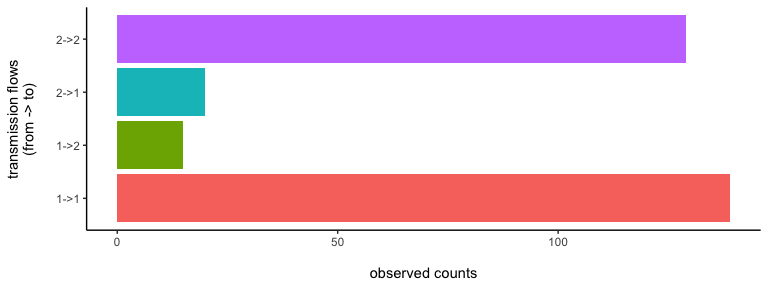
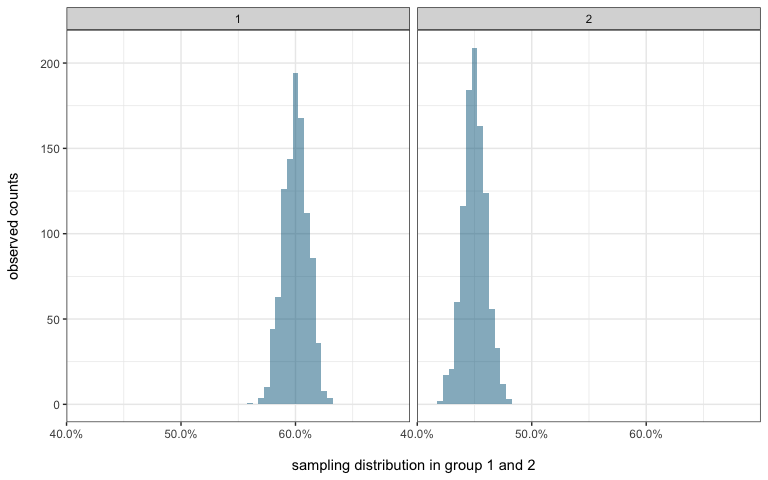
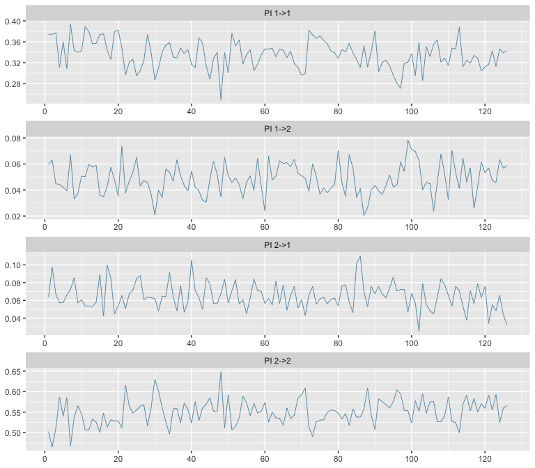

This vignette gives a basic first introduction to estimating
transmission flows with the `phyloflows` package.

Input data
==========

**phyloflows** expects input data in a specific format.

-   `dobs` a data.frame of observed transmission counts within and
    between population groups.
-   `dprior` a data.frame that summarises prior information on how
    population groups were sampled.

To get you started, **phyloflows** comes with a small simulated example
data set of transmission counts and sampling information between two
population groups, denoted by “1” and “2”:

    #   required R packages
    require(phyloflows)
    require(ggplot2)
    require(bayesplot)
    require(data.table)
    require(coda)

    #
    #   load transmission flow data "twoGroupFlows1"
    data(twoGroupFlows1, package="phyloflows")
    #   observed transmission counts
    dobs <- twoGroupFlows1$dobs
    #   sampling information
    dprior <- twoGroupFlows1$dprior

Input data: observed transmission flows
---------------------------------------

    dobs
    #>    REC_TRM_CATEGORY TR_TRM_CATEGORY TR_SAMPLING_CATEGORY
    #> 1:                1               1                    1
    #> 2:                2               1                    1
    #> 3:                1               2                    2
    #> 4:                2               2                    2
    #>    REC_SAMPLING_CATEGORY TRM_OBS TRM_CAT_PAIR_ID
    #> 1:                     1     139               1
    #> 2:                     2      15               2
    #> 3:                     1      20               3
    #> 4:                     2     129               4

**`dobs` specifies observed counts of transmissions from a transmitter
group to a recipient group.** It must contain the following columns:

-   *TR\_TRM\_CATEGORY* name of transmitter group.
-   *REC\_TRM\_CATEGORY* name of recipient group.
-   *TRM\_CAT\_PAIR\_ID* identifier of transmitter-recipient pair
-   *TRM\_OBS* observed transmission counts

Let us look at the data. The first row contains counts of transmission
flows from group “1” to group “1”, and there are 139 of them. The next
row contains counts of transmission flows from group “1” to group “2”,
and there are 15 of them. Here is a barplot of our input data:

Input data: sampling information
--------------------------------

**`dobs` also must contain information about how each group was
sampled.** This is stored in the following columns:

-   *TR\_SAMPLING\_CATEGORY* sampling strata of transmitter group
-   *REC\_SAMPLING\_CATEGORY* sampling strata of recipient group

Each transmitter/recipient group is associated to a sampling category.
This can be “sampling group a” for both “1” and “2”, or “a” and “b”
respectively for “1” and “2”. In our little data set, we gave the same
name to transmitter/recipient and sampling groups.

**`dprior` specifies the probability of sampling an individual from each
sampling group.** To keep this as flexible as possible, samples from the
sampling distribution, rather than say the mean and standard deviation,
need to be given. This information is stored in the following columns:

-   *SAMPLING\_CATEGORY* name of sampling strata
-   *SAMPLE* identifier of sample from the sampling distribution
-   *P* sampling probability
-   *LP* log density of the sampling probability under the sampling
    distribution.

Let us look at the sampling information:

    head(dprior)
    #>    SAMPLING_CATEGORY         P SAMPLE       LP
    #> 1:                 1 0.5824160      1 2.318750
    #> 2:                 1 0.6184042      2 2.168504
    #> 3:                 1 0.6033518      3 3.548540
    #> 4:                 1 0.6015475      4 3.585452
    #> 5:                 1 0.5918721      5 3.321375
    #> 6:                 1 0.6034198      6 3.546614

Here is a histogram of the sampling distribution from sampling groups
“1” and “2”. Notice that in our example, the probability of sampling
individuals in group “1” is higher than that among individuals in group
“2”.

Statistical model
=================

`phyloflows` **uses a Bayesian approach to estimate the proportion of
transmissions** between the two population groups,
$\pi = (\pi\_{11}, \pi\_{12}, \pi\_{21}, \pi\_{22})$.
The model can be motivated as follows. Suppose the actual, unobserved
number of transmissions from group $i$ to group $j$ are
$z\_{ij}$. Denote the vector of actual transmission counts by
$z = (z_{11}, z_{12}, z_{21}, z_{22})$.
We assume that transmission events occurred independently of each other.
Then the likelihood of the actual transmission counts can be modelled by
$p(z|Z, \pi) = \textrm{Multinomial}(z; Z, \pi)$,
where $Z$ is the total number of transmissions,
$Z = \sum\_{k,l}z_{kl}$. Next, we specify a model
for observing one actual transmission event. We assume that sampling
occurred at random within each of the sampling groups $i$ and $j$. We
then obtain
$p(n\_{ij}|z\_{ij}, s_i, s_j) = \mathrm{Binomial}(n\_{ij}; z\_{ij}, s_i \times s_j)$,
where $s_i$ is the probability of sampling an individual
from group $i$.

These equations suggest that one approach to infer the proportion of
transmissions $\pi$ could be via data augmentation. In data augmentation,
we would consider the unobserved, actual transmission counts $z$ as
latent variables, and then infer the joint posterior distribution of the
parameters $(z, Z, \pi)$ with a Monte Carlo algorithm.

**However there is a more efficient approach for the particular model
above.** Inference of $\pi$ under the Multinomial likelihood
$\textrm{Multinomial}(z; Z, \pi)$ is equivalent to
inference of Poisson mean rates $\lambda$  
$\lambda = (\lambda_{11}, \lambda_{12}, \lambda_{21}, \lambda_{22})$
in the system of independent Poisson likelihoods
$p(z\_{ij}|\lambda_{ij}) = \mathrm{Poisson}(z; \lambda_{ij})$,
where $\lambda_{ij} > 0$, $i \in \\{1, 2\\}$ and $j \in \\{1, 2\\}$. The
proportion of transmissions *π* are recovered via the equations
$\pi_{ij} = \lambda_{ij}/\sum_{k,l \in \\{1, 2\\}}\lambda_{kl}$
for $i \in \\{1, 2\\}$ and $j \in \\{1, 2\\}$. This is known as the Poisson trick. The
advantage of this model parameterisation is that sampled Poisson random
variables are again Poisson random variables, which allows us to
integrate out analytically the unknown, actual transmission counts
$z_{ij}$. We obtain  
$p(n|\lambda,s) = \prod_{i,j \in\\{1, 2\\}}\mathrm{Poisson}(n_{ij}; \lambda_{ij} \times s_i \times s_j)$.

The free parameters of the model are $(\lambda, s)$, and the posterior
distribution of the free parameters is given by
$$
\\begin{aligned}
p(\\lambda, s | n) & \\propto p(n | \\lambda, s) p(\\lambda, s) \\\\
              & = \\prod\_{i,j \in \\{1,2\\}} \mathrm{Poisson}(n\_{ij};\\lambda\_{ij}\times s\_i\times s\_j) p(\\lambda\_{ij}) p(s\_i) p(s\_j).
\\end{aligned}
$$

**For the prior distributions**, we specify for
$p\times(\lambda_{ij})$, $i,j \in \\{1,2\\}$ uninformative prior
distributions. We use a Gamma distribution with parameters
$\alpha_i = 0.8/4$ and $\beta = 0.8/Z$ with
$Z = \sum_{i,j | | n_{ij} > 0 }n_{ij}/(s_i \times s_j) + \sum_{i,j | n_{ij} > 0} (1 − s_i\times s_j)/(s_i\times s_j)$.
This choice implies for *π* a Dirichlet prior distribution with
parameters *α**i*, which is considered to be an objective
choice. For *p*(*s**i*), we use a strongly informative prior
distribution, based on the available data as illustrated above.

MCMC
====

MCMC syntax
-----------

We use a Markov Chain Monte Carlo algorithm to sample from the posterior
distribution
*p*(*λ*, *s*|*n*) ∝ ∏*i* = 1, 2; *j* = 1, 2*P**o**i**s**s**o**n*(*n**i**j*; *λ**i**j* \* *s**i* \* *s**j*)*p*(*λ**i**j*)*p*(*s**i*)*p*(*s**j*).
Then, we calculate the main quantity of interest, *π*, via
*π**i**j* = *λ**i**j*/∑*k* = 1, 2; *l* = 1, 2*λ**k**l*.
for *i* = 1, 2 and *j* = 1, 2. The syntax for running the algorithm is
as follows.

    # specify a list of control variables:
    #   seed    random number seed
    #   mcmc.n  number of MCMC iterations
    #   verbose flag for verbose output
    #   outfile output file name if you like to have the results 
    #           written to an *.rda* file
    control <- list(seed=42, mcmc.n=500, verbose=0)
    # run MCMC
    ans <- source.attribution.mcmc(dobs, dprior, control)
    #> 
    #> Setting seed to 42
    #> Number of parameters:     6
    #> Dimension of PI:  4
    #> Sweep length:     4
    #> Number of sweeps:     125
    #> Number of iterations:     500
    #> Sweeps done:  100

MCMC messages
-------------

Let s have a look at the output messages.

-   `Setting seed to 42`: This tells us the random number seed that was
    used, so we can re-run the algorithm to get identical results.
-   `Number of parameters: 6`: The total number of unknown parameters in
    the MCMC is the length of *λ* plus length of the sampling
    probabilities *s*. Here, the number of flows between the two
    subpopulation is 4, and sampling was different in each
    subpopulation, adding 2 parameters.
-   `Dimension of PI: 4`: the number of flows between the two
    subpopulations is 4.
-   `Sweep length: 4`: the MCMC updates in turn a subset of the sampling
    probabilities of transmission groups
    *ξ* = (*ξ*11, *ξ*12, *ξ*21, *ξ*22),  *ξ**i**j* = *s**i* \* *s**j*,
      
    which is followed by an update of the entire vector of Poisson
    transmission rates *λ*. The subset of *ξ* that is updated is
    specified as follows. For each population group *i*, we determine
    all components of *ξ* that involve *s**i*. In our
    example, for *i* = 1, the components of *ξ* to update are
    (*ξ*11, *ξ*12, *ξ*21); and for
    *i* = 2, the components of *ξ* to update are
    (*ξ*12, *ξ*21, *ξ*22). An MCMC
    sweep counts the number of MCMC iterations needed in order to update
    all parameters at least once. In our case, we have 2 updates on
    components of *ξ*, and after each we update *λ*, so the sweep length
    is 4.
-   `Number of sweeps: 125`: The total number of sweeps is determined
    from `control[['mcmc.n']]`, by dividing `control[['mcmc.n']]` with
    the sweep length, and possibly rounding up.
-   `Number of iterations: 500`: The total number of iterations is set
    to the number of sweeps (given above), multiplied by the sweep
    length. This may differ slightly from `control[['mcmc.n']]` because
    we round up the number of sweeps to the next integer.

MCMC output
-----------

Let us have a look at the output:

    str(ans)
    #> List of 14
    #>  $ with.sampling: logi TRUE
    #>  $ time         : 'difftime' num 0.154473066329956
    #>   ..- attr(*, "units")= chr "secs"
    #>  $ dlu          :Classes 'data.table' and 'data.frame':  2 obs. of  2 variables:
    #>   ..$ SAMPLING_CATEGORY: num [1:2] 1 2
    #>   ..$ UPDATE_ID        : int [1:2] 1 2
    #>   ..- attr(*, ".internal.selfref")=<externalptr> 
    #>   ..- attr(*, "sorted")= chr "UPDATE_ID"
    #>  $ dl           :Classes 'data.table' and 'data.frame':  8 obs. of  4 variables:
    #>   ..$ SAMPLING_CATEGORY: num [1:8] 1 1 1 1 2 2 2 2
    #>   ..$ UPDATE_ID        : int [1:8] 1 1 1 1 2 2 2 2
    #>   ..$ TRM_CAT_PAIR_ID  : int [1:8] 1 2 1 3 3 4 2 4
    #>   ..$ WHO              : Factor w/ 2 levels "TR_SAMPLING_CATEGORY",..: 1 1 2 2 1 1 2 2
    #>   ..- attr(*, ".internal.selfref")=<externalptr> 
    #>   ..- attr(*, "sorted")= chr "UPDATE_ID"
    #>  $ dlt          :Classes 'data.table' and 'data.frame':  4 obs. of  4 variables:
    #>   ..$ TRM_CAT_PAIR_ID: int [1:4] 1 2 3 4
    #>   ..$ TR_UPDATE_ID   : int [1:4] 1 1 2 2
    #>   ..$ REC_UPDATE_ID  : int [1:4] 1 2 1 2
    #>   ..$ TRM_OBS        : int [1:4] 139 15 20 129
    #>   ..- attr(*, ".internal.selfref")=<externalptr> 
    #>   ..- attr(*, "sorted")= chr "TRM_CAT_PAIR_ID"
    #>  $ nprior       : int 1000
    #>  $ sweep        : int 4
    #>  $ nsweep       : num 125
    #>  $ n            : num 500
    #>  $ sweep_group  : num 125
    #>  $ pars         :List of 7
    #>   ..$ ALPHA     : num [1, 1:4] 0.2 0.2 0.2 0.2
    #>   ..$ BETA      : num 0.000692
    #>   ..$ XI        : num [1:126, 1:2] 0.603 0.588 0.586 0.586 0.602 ...
    #>   ..$ XI_LP     : num [1:126, 1:2] 3.56 3 2.77 2.77 3.58 ...
    #>   ..$ S         : num [1:126, 1:4] 0.364 0.346 0.343 0.343 0.362 ...
    #>   ..$ S_LP      : num [1:126, 1:4] 7.12 6.01 5.53 5.53 7.16 ...
    #>   ..$ LOG_LAMBDA: num [1:126, 1:4] 6.07 6.12 6.07 6.03 6.02 ...
    #>  $ it.info      :Classes 'data.table' and 'data.frame':  501 obs. of  7 variables:
    #>   ..$ IT       : int [1:501] 0 1 2 3 4 5 6 7 8 9 ...
    #>   ..$ PAR_ID   : int [1:501] 0 1 1 2 2 1 1 2 2 1 ...
    #>   ..$ BLOCK    : chr [1:501] "INIT" "XI" "LOG_LAMBDA" "XI" ...
    #>   ..$ MHRATIO  : num [1:501] 1 1 1 1 1 ...
    #>   ..$ ACCEPT   : int [1:501] 1 1 1 1 1 1 1 1 1 0 ...
    #>   ..$ LOG_LKL  : num [1:501] -13.6 -12.8 -14 -14 -16.5 ...
    #>   ..$ LOG_PRIOR: num [1:501] -22.3 -22.8 -22.4 -22.4 -23.3 ...
    #>   ..- attr(*, ".internal.selfref")=<externalptr> 
    #>  $ curr.it      : int 501
    #>  $ curr.it.adj  : int 501

We are mostly interested in the marginal posterior distribution
*p*(*π*|*n*),
and the algorithm returns samples of log *λ*. Let us calculate the
transmission flows *π* from the log Poisson rates, and make a trace
plot:

    #   transform lambda to pi
    tmp <- exp(ans[['pars']][['LOG_LAMBDA']])
    posterior.pi <- t(apply(tmp, 1, function(rw) rw/sum(rw))) 
    #   make column names
    setkey(dobs, TRM_CAT_PAIR_ID) #order by pair IDs
    post.pi.colnames <- paste0('PI ',dobs$TR_TRM_CATEGORY,'->',dobs$REC_TRM_CATEGORY)
    colnames(posterior.pi) <- post.pi.colnames
    #   plot mcmc trajectories 
    bayesplot:::mcmc_trace( posterior.pi, 
                            pars=colnames(posterior.pi), 
                            facet_args = list(ncol = 1), 
                            n_warmup=0)

Notice that the posterior estimate for transmissions within group “2” is
about 55%. This is considerably larger than the raw estimate from the
observed transmission counts, 129/303=43%, because individuals in group
“2” have lower probability of being sampled than those in group “1”.

That’s it for now. Of course we would like to run the MCMC chain for
longer, perhaps 10,000 sweeps. We would also like to check for
convergence, calculate effective sample sizes, and quantiles of the
posterior distribution. But this is for later. Use your R wizadry to
process the output further, and have a look at the other vignettes.
