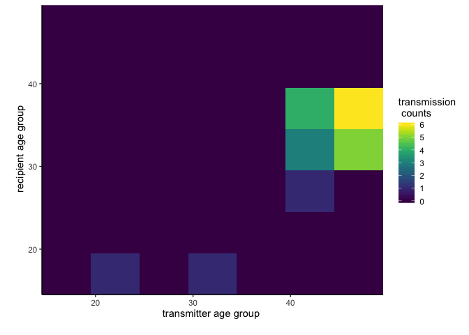
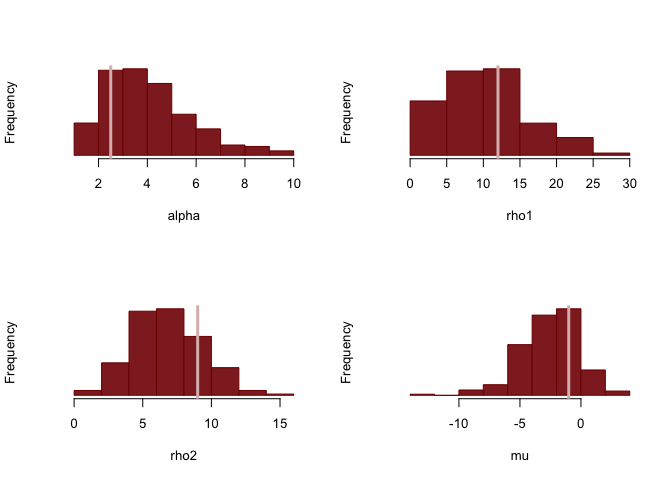

This vignette provides an extension of the general method of
**phyloflow**. The aim is to understand the transmission flows between
one-year increment age groups. The differences between this example with
the general pipeline of **phyloflow** is the correlation between flows.
To tackle this problem, we impose a Gaussian process (GP) prior on
transmission flows. Also, a more flexible platform, Stan, is introduced
to solve the problem.

Dataset
=======

**We start with simulating transmission counts** between seven age
groups called “15-19”,“20-24”,“25-29”,“30-34”,“35-39”,“40-44”,“45-49”.
Note that in practice, it would be good to use this method to
investigate transmission dynamics between one-year increment age group,
as the squared exponential kernel is for the continuous input space. We
first set up hyperparameters for GP, the baseline and sampling
fractions.

    library(rstan)
    library(data.table)
    library(ggplot2)
    library(viridis)
    library(phyloflows)
    set.seed(42)
    rstan_options(auto_write = TRUE)
    options(mc.cores = parallel::detectCores())
    alpha_true <- c(2.5)
    rho_true <- c(12,9)
    mu_true <- -1
    gp_dim <- 2
    xi <- c(0.35, 0.45, 0.5, 0.55, 0.5, 0.55, 0.4)

**Next, we calculate the sampling probabilities of transmission flows
within and between the two groups.**

    dobs <- data.table(expand.grid(TR_TRM_CATEGORY = c("15-19","20-24","25-29","30-34","35-39","40-44","45-49"),
                                   REC_TRM_CATEGORY = c("15-19","20-24","25-29","30-34","35-39","40-44","45-49")))

    ds <- data.table(CATEGORY = c("15-19","20-24","25-29",
                                  "30-34","35-39","40-44","45-49"),
                     P = xi,ID = 1:7)

    setnames(ds,colnames(ds),paste0('TR_TRM_',colnames(ds)))
    dobs <- merge(dobs,ds,by='TR_TRM_CATEGORY')
    setnames(ds,colnames(ds),gsub('TR_','REC_',colnames(ds)))
    dobs <- merge(dobs,ds,by='REC_TRM_CATEGORY')
    setnames(ds,colnames(ds),gsub('REC_TRM_','',colnames(ds)))
    dobs[,P:= TR_TRM_P * REC_TRM_P]
    dobs[,TR_SMOOTH_CATEGORY:=as.numeric(substr(TR_TRM_CATEGORY,1,2))+2]
    dobs[,REC_SMOOTH_CATEGORY:=as.numeric(substr(REC_TRM_CATEGORY,1,2))+2]
    dobs[, TR_SAMPLING_CATEGORY:= TR_TRM_CATEGORY]
    dobs[, REC_SAMPLING_CATEGORY:= REC_TRM_CATEGORY]

**Then we simulate true transmission flows and observed transmission
counts.**

    simu_pars <- list(  N=nrow(dobs), D=gp_dim, x=cbind(dobs$TR_SMOOTH_CATEGORY,dobs$REC_SMOOTH_CATEGORY),
                       alpha=alpha_true, rho=rho_true,
                       mu=mu_true,xi=dobs$P)
    #   simulate data set   
    simu_fit <- stan(   file="simu_poiss.stan", 
                      data=simu_pars, iter=1,
                      chains=1, seed=424838, algorithm="Fixed_param")
    dobs$TRM_OBS <- extract(simu_fit)$y[1,] 

The data can be loaded through

    data(sevenGroupFlows1)

Input data: observed transmission flows
=======================================

Input data of the similar format of **phyloflow** are expected.

    dobs <- subset(dobs, select = c('TR_TRM_CATEGORY', 'REC_TRM_CATEGORY','TR_SAMPLING_CATEGORY',
                                    'REC_SAMPLING_CATEGORY', 'TR_SMOOTH_CATEGORY','REC_SMOOTH_CATEGORY',
                                    'TRM_OBS'))
    head(dobs)

    ##    TR_TRM_CATEGORY REC_TRM_CATEGORY TR_SAMPLING_CATEGORY REC_SAMPLING_CATEGORY TR_SMOOTH_CATEGORY REC_SMOOTH_CATEGORY
    ## 1:           15-19            15-19                15-19                 15-19                 17                  17
    ## 2:           20-24            15-19                20-24                 15-19                 22                  17
    ## 3:           25-29            15-19                25-29                 15-19                 27                  17
    ## 4:           30-34            15-19                30-34                 15-19                 32                  17
    ## 5:           35-39            15-19                35-39                 15-19                 37                  17
    ## 6:           40-44            15-19                40-44                 15-19                 42                  17
    ##    TRM_OBS
    ## 1:       0
    ## 2:       1
    ## 3:       0
    ## 4:       1
    ## 5:       0
    ## 6:       0

**`dobs` specifies observed counts of transmissions from a transmitter
age group to a recipient age group.** It must contain the following
columns:

-   *TR\_TRM\_CATEGORY* name of transmitter group.
-   *REC\_TRM\_CATEGORY* name of recipient group.
-   *TR\_SMOOTH\_CATEGORY* midpoint of transmitter age group.
-   *REC\_SMOOTH\_CATEGORY* midpoint of recipient age group.
-   *TRM\_CAT\_PAIR\_ID* identifier of transmitter-recipient pair
-   *TRM\_OBS* observed transmission counts

Let us look at the data. The first row shows zero counts of transmission
flows from age group “15-19” to age group “15-19”. We visualise our
simulated input data in the heatmap :

    ggplot(dobs, aes(TR_SMOOTH_CATEGORY, REC_SMOOTH_CATEGORY))+
      geom_tile(aes(fill = TRM_OBS)) +
      scale_fill_viridis() +
      scale_x_continuous(expand = c(0,0), limits = c(14.5,49.5))+
      scale_y_continuous(expand = c(0,0), limits = c(14.5,49.5))+
      theme_classic()+
      labs(x='transmitter age group \n', y='\n recipient age group',fill='transmission \n counts')

Input data: sampling information
--------------------------------

**`dobs` also requires information about how each group was sampled. **
This is stored in the following columns:

-   *TR\_SAMPLING\_CATEGORY* sampling strata of transmitter group
-   *REC\_SAMPLING\_CATEGORY* sampling strata of recipient group

**`dprior.fit` specifies the distribution of sampling probability in
each sampling group.** The sampling probability is either characterised
by beta-binomial model or GLM model (See 01 - Simulating data). and
given in the form of samples. In the tutorial, we opted for a
probabilistic programming language Stan, and it cannot take samples as
input. However, it is possible to fit statistical distributions to
samples and input distribution parameters. The information is stored in
data *dprior.fit* in the following columns:

-   *SAMPLING\_CATEGORY* name of sampling strata
-   *ALPHA, BETA* shape parameters of the distribution of sampling
    probability.

Under beta-binomial model, the posterior distribution of the sampling
probability is known analytically, i.e. beta. Let us look at the
sampling information:

    ds$TRIAL <- c(4000, 3700, 3300, 2500, 1700, 1000, 500)
    ds[,SUC := round(TRIAL * P)]
    dprior.fit <- copy(ds)
    dprior.fit[,ALPHA := SUC+1]
    dprior.fit[,BETA := TRIAL-SUC+1]
    dprior.fit <- subset(dprior.fit, select = c('CATEGORY','ALPHA','BETA'))
    colnames(dprior.fit) <- c('SAMPLING_CATEGORY','ALPHA','BETA')
    head(dprior.fit)

    ##    SAMPLING_CATEGORY ALPHA BETA
    ## 1:             15-19  1401 2601
    ## 2:             20-24  1666 2036
    ## 3:             25-29  1651 1651
    ## 4:             30-34  1376 1126
    ## 5:             35-39   851  851
    ## 6:             40-44   551  451

Method
======

Again we use a Bayesian approach to estimate the proportion of
transmissions between the two population groups. Please see the problem
setting in **phyloflows: Estimating transmission flows under
heterogeneous sampling – a first example**. Unlike the simple example, a
probabilistic programming language Stan provides a flexible platform to
impose different kinds of priors. Recall the posterior distribution of
the parameters (*λ*, *s*) is given by
$$
\\begin{aligned}
p(\\lambda, s | n) & \\propto p(n | \\lambda, s) p(\\lambda, s) \\\\
              & = \\prod\_{i=1,\\cdots,7;j=1\\cdots,7} Poisson(n\_{ij};\\lambda\_{ij}\*s\_i\*s\_j) p(\\lambda\_{ij}) p(s\_i) p(s\_j).
\\end{aligned}
$$
Then, we calculate the main quantity of interest, *π*, via
*π**i**j* = *λ**i**j*/∑*k* = 1, ⋯, 7; *l* = 1, ⋯, 7*λ**k**l*.
for *i* = 1, ⋯, 7 and *j* = 1, ⋯, 7.

**For the prior distributions**, we specify for
*p*(*λ**i**j*), *i* = 1, 2; *j* = 1, 2 uninformative prior
distributions. We use a Gamma distribution with parameters
*α**i* = 0.8/72 and *β* = 0.8/*Z* with
*Z* = ∑*i**j*|*n**i**j* &gt; 0*n**i**j*/(*s**i* \* *s**j*) + ∑*i**j*|*n**i**j* &gt; 0(1 − *s**i* \* *s**j*)/(*s**i* \* *s**j*).
This choice implies for *π* a Dirichlet prior distribution with
parameters *α**i*, which is considered to be an objective
choice. For *p*(*s**i*), we use a strongly informative prior
distribution, based on the available data as illustrated above.

An alternative prior distribution is Gaussian process prior, which
penalises large changes between neighbouring age groups, and the kernel
*k* is given by

$$
k((a,b),(a',b'))= \\sigma^2 \\exp(-0.5 ((\\frac{a-a'}{\\ell\_1})^2 + (\\frac{b-b'}{\\ell\_2})^2 ))
$$
That is, *λ**i*, *j* = *μ* + *f* where *f* ∼ 𝒢𝒫(0, *k*).

MCMC
====

MCMC syntax
-----------

We use a Markov Chain Monte Carlo algorithm to sample from the posterior
The syntax for running the algorithm is as follows.

    # specify a list of control variables:
    #   seed    random number seed
    #   mcmc.n  number of MCMC iterations
    #   method "gamma" or "gp"
    #   outfile output file name if you like to have the results 
    #           written to an *.rda* file
    control <- list(seed=42, mcmc.n=500, method='gamma')
    # run MCMC
    ans.gamma <- source.attribution.mcmc.stan(dobs, dprior.fit, control)
    # save(ans.gamma, file = '~/phyloscanner/phyloflows/data/sevenGroupFlows1_gamma_mcmc.RData')

    control <- list(seed=42, mcmc.n=500, method='gp')
    # run MCMC
    ans.gp <- source.attribution.mcmc.stan(dobs, dprior.fit, control)
    # save(ans.gp, file = '~/phyloscanner/phyloflows/data/sevenGroupFlows1_gp_mcmc.RData')

MCMC output
-----------

Let us have a look at the output:

    str(ans.gamma)

    ## Formal class 'stanfit' [package "rstan"] with 10 slots
    ##   ..@ model_name: chr "gamma"
    ##   ..@ model_pars: chr [1:6] "lambda" "xi" "lxi_pair" "betav" ...
    ##   ..@ par_dims  :List of 6
    ##   .. ..$ lambda  : num 49
    ##   .. ..$ xi      : num 7
    ##   .. ..$ lxi_pair: num 49
    ##   .. ..$ betav   : num 49
    ##   .. ..$ beta    : num(0) 
    ##   .. ..$ lp__    : num(0) 
    ##   ..@ mode      : int 0
    ##   ..@ sim       :List of 12
    ##   .. ..$ samples    :List of 1
    ##   .. .. ..$ :List of 156
    ##   .. .. .. ..$ lambda[1]   : num [1:500] 0.00883 0.00883 0.00883 0.00883 0.00946 ...
    ##   .. .. .. ..$ lambda[2]   : num [1:500] 0.697 0.697 0.697 0.697 0.694 ...
    ##   .. .. .. ..$ lambda[3]   : num [1:500] 0.07 0.07 0.07 0.07 0.0693 ...
    ##   .. .. .. ..$ lambda[4]   : num [1:500] 7.09 7.09 7.09 7.09 6.87 ...
    ##   .. .. .. ..$ lambda[5]   : num [1:500] 0.124 0.124 0.124 0.124 0.121 ...
    ##   .. .. .. ..$ lambda[6]   : num [1:500] 0.0621 0.0621 0.0621 0.0621 0.0625 ...
    ##   .. .. .. ..$ lambda[7]   : num [1:500] 2.86e-05 2.86e-05 2.86e-05 2.86e-05 2.71e-05 ...
    ##   .. .. .. ..$ lambda[8]   : num [1:500] 0.281 0.281 0.281 0.281 0.281 ...
    ##   .. .. .. ..$ lambda[9]   : num [1:500] 0.0357 0.0357 0.0357 0.0357 0.0354 ...
    ##   .. .. .. ..$ lambda[10]  : num [1:500] 0.0446 0.0446 0.0446 0.0446 0.0451 ...
    ##   .. .. .. ..$ lambda[11]  : num [1:500] 0.857 0.857 0.857 0.857 0.93 ...
    ##   .. .. .. ..$ lambda[12]  : num [1:500] 0.0186 0.0186 0.0186 0.0186 0.0185 ...
    ##   .. .. .. ..$ lambda[13]  : num [1:500] 0.000392 0.000392 0.000392 0.000392 0.000387 ...
    ##   .. .. .. ..$ lambda[14]  : num [1:500] 0.00137 0.00137 0.00137 0.00137 0.00135 ...
    ##   .. .. .. ..$ lambda[15]  : num [1:500] 0.666 0.666 0.666 0.666 0.609 ...
    ##   .. .. .. ..$ lambda[16]  : num [1:500] 0.0176 0.0176 0.0176 0.0176 0.0175 ...
    ##   .. .. .. ..$ lambda[17]  : num [1:500] 0.0438 0.0438 0.0438 0.0438 0.0425 ...
    ##   .. .. .. ..$ lambda[18]  : num [1:500] 0.033 0.033 0.033 0.033 0.0355 ...
    ##   .. .. .. ..$ lambda[19]  : num [1:500] 0.142 0.142 0.142 0.142 0.14 ...
    ##   .. .. .. ..$ lambda[20]  : num [1:500] 2.94 2.94 2.94 2.94 2.9 ...
    ##   .. .. .. ..$ lambda[21]  : num [1:500] 0.391 0.391 0.391 0.391 0.354 ...
    ##   .. .. .. ..$ lambda[22]  : num [1:500] 0.671 0.671 0.671 0.671 0.659 ...
    ##   .. .. .. ..$ lambda[23]  : num [1:500] 1.17 1.17 1.17 1.17 1.06 ...
    ##   .. .. .. ..$ lambda[24]  : num [1:500] 0.0741 0.0741 0.0741 0.0741 0.0775 ...
    ##   .. .. .. ..$ lambda[25]  : num [1:500] 0.00197 0.00197 0.00197 0.00197 0.00191 ...
    ##   .. .. .. ..$ lambda[26]  : num [1:500] 0.124 0.124 0.124 0.124 0.126 ...
    ##   .. .. .. ..$ lambda[27]  : num [1:500] 7.29 7.29 7.29 7.29 6.91 ...
    ##   .. .. .. ..$ lambda[28]  : num [1:500] 0.078 0.078 0.078 0.078 0.0768 ...
    ##   .. .. .. ..$ lambda[29]  : num [1:500] 0.0512 0.0512 0.0512 0.0512 0.0497 ...
    ##   .. .. .. ..$ lambda[30]  : num [1:500] 0.321 0.321 0.321 0.321 0.328 ...
    ##   .. .. .. ..$ lambda[31]  : num [1:500] 0.0196 0.0196 0.0196 0.0196 0.0187 ...
    ##   .. .. .. ..$ lambda[32]  : num [1:500] 0.00496 0.00496 0.00496 0.00496 0.00467 ...
    ##   .. .. .. ..$ lambda[33]  : num [1:500] 0.0136 0.0136 0.0136 0.0136 0.0133 ...
    ##   .. .. .. ..$ lambda[34]  : num [1:500] 0.131 0.131 0.131 0.131 0.135 ...
    ##   .. .. .. ..$ lambda[35]  : num [1:500] 8.02 8.02 8.02 8.02 8.04 ...
    ##   .. .. .. ..$ lambda[36]  : num [1:500] 0.731 0.731 0.731 0.731 0.778 ...
    ##   .. .. .. ..$ lambda[37]  : num [1:500] 0.38 0.38 0.38 0.38 0.347 ...
    ##   .. .. .. ..$ lambda[38]  : num [1:500] 0.000202 0.000202 0.000202 0.000202 0.000205 ...
    ##   .. .. .. ..$ lambda[39]  : num [1:500] 0.00875 0.00875 0.00875 0.00875 0.00957 ...
    ##   .. .. .. ..$ lambda[40]  : num [1:500] 0.00122 0.00122 0.00122 0.00122 0.00132 ...
    ##   .. .. .. ..$ lambda[41]  : num [1:500] 1.24 1.24 1.24 1.24 1.22 ...
    ##   .. .. .. ..$ lambda[42]  : num [1:500] 0.0574 0.0574 0.0574 0.0574 0.0569 ...
    ##   .. .. .. ..$ lambda[43]  : num [1:500] 0.0333 0.0333 0.0333 0.0333 0.0357 ...
    ##   .. .. .. ..$ lambda[44]  : num [1:500] 0.176 0.176 0.176 0.176 0.164 ...
    ##   .. .. .. ..$ lambda[45]  : num [1:500] 0.026 0.026 0.026 0.026 0.0257 ...
    ##   .. .. .. ..$ lambda[46]  : num [1:500] 0.00561 0.00561 0.00561 0.00561 0.00529 ...
    ##   .. .. .. ..$ lambda[47]  : num [1:500] 0.000297 0.000297 0.000297 0.000297 0.00031 ...
    ##   .. .. .. ..$ lambda[48]  : num [1:500] 0.291 0.291 0.291 0.291 0.293 ...
    ##   .. .. .. ..$ lambda[49]  : num [1:500] 0.000651 0.000651 0.000651 0.000651 0.000661 ...
    ##   .. .. .. ..$ xi[1]       : num [1:500] 0.118 0.118 0.118 0.118 0.202 ...
    ##   .. .. .. ..$ xi[2]       : num [1:500] 0.51 0.51 0.51 0.51 0.48 ...
    ##   .. .. .. ..$ xi[3]       : num [1:500] 0.609 0.609 0.609 0.609 0.561 ...
    ##   .. .. .. ..$ xi[4]       : num [1:500] 0.543 0.543 0.543 0.543 0.557 ...
    ##   .. .. .. ..$ xi[5]       : num [1:500] 0.432 0.432 0.432 0.432 0.46 ...
    ##   .. .. .. ..$ xi[6]       : num [1:500] 0.644 0.644 0.644 0.644 0.617 ...
    ##   .. .. .. ..$ xi[7]       : num [1:500] 0.241 0.241 0.241 0.241 0.247 ...
    ##   .. .. .. ..$ lxi_pair[1] : num [1:500] -4.27 -4.27 -4.27 -4.27 -3.2 ...
    ##   .. .. .. ..$ lxi_pair[2] : num [1:500] -2.81 -2.81 -2.81 -2.81 -2.34 ...
    ##   .. .. .. ..$ lxi_pair[3] : num [1:500] -2.63 -2.63 -2.63 -2.63 -2.18 ...
    ##   .. .. .. ..$ lxi_pair[4] : num [1:500] -2.74 -2.74 -2.74 -2.74 -2.19 ...
    ##   .. .. .. ..$ lxi_pair[5] : num [1:500] -2.97 -2.97 -2.97 -2.97 -2.38 ...
    ##   .. .. .. ..$ lxi_pair[6] : num [1:500] -2.57 -2.57 -2.57 -2.57 -2.08 ...
    ##   .. .. .. ..$ lxi_pair[7] : num [1:500] -3.56 -3.56 -3.56 -3.56 -3 ...
    ##   .. .. .. ..$ lxi_pair[8] : num [1:500] -2.81 -2.81 -2.81 -2.81 -2.34 ...
    ##   .. .. .. ..$ lxi_pair[9] : num [1:500] -1.35 -1.35 -1.35 -1.35 -1.47 ...
    ##   .. .. .. ..$ lxi_pair[10]: num [1:500] -1.17 -1.17 -1.17 -1.17 -1.31 ...
    ##   .. .. .. ..$ lxi_pair[11]: num [1:500] -1.28 -1.28 -1.28 -1.28 -1.32 ...
    ##   .. .. .. ..$ lxi_pair[12]: num [1:500] -1.51 -1.51 -1.51 -1.51 -1.51 ...
    ##   .. .. .. ..$ lxi_pair[13]: num [1:500] -1.11 -1.11 -1.11 -1.11 -1.22 ...
    ##   .. .. .. ..$ lxi_pair[14]: num [1:500] -2.1 -2.1 -2.1 -2.1 -2.13 ...
    ##   .. .. .. ..$ lxi_pair[15]: num [1:500] -2.63 -2.63 -2.63 -2.63 -2.18 ...
    ##   .. .. .. ..$ lxi_pair[16]: num [1:500] -1.17 -1.17 -1.17 -1.17 -1.31 ...
    ##   .. .. .. ..$ lxi_pair[17]: num [1:500] -0.993 -0.993 -0.993 -0.993 -1.156 ...
    ##   .. .. .. ..$ lxi_pair[18]: num [1:500] -1.11 -1.11 -1.11 -1.11 -1.16 ...
    ##   .. .. .. ..$ lxi_pair[19]: num [1:500] -1.34 -1.34 -1.34 -1.34 -1.35 ...
    ##   .. .. .. ..$ lxi_pair[20]: num [1:500] -0.937 -0.937 -0.937 -0.937 -1.06 ...
    ##   .. .. .. ..$ lxi_pair[21]: num [1:500] -1.92 -1.92 -1.92 -1.92 -1.98 ...
    ##   .. .. .. ..$ lxi_pair[22]: num [1:500] -2.74 -2.74 -2.74 -2.74 -2.19 ...
    ##   .. .. .. ..$ lxi_pair[23]: num [1:500] -1.28 -1.28 -1.28 -1.28 -1.32 ...
    ##   .. .. .. ..$ lxi_pair[24]: num [1:500] -1.11 -1.11 -1.11 -1.11 -1.16 ...
    ##   .. .. .. ..$ lxi_pair[25]: num [1:500] -1.22 -1.22 -1.22 -1.22 -1.17 ...
    ##   .. .. .. ..$ lxi_pair[26]: num [1:500] -1.45 -1.45 -1.45 -1.45 -1.36 ...
    ##   .. .. .. ..$ lxi_pair[27]: num [1:500] -1.05 -1.05 -1.05 -1.05 -1.07 ...
    ##   .. .. .. ..$ lxi_pair[28]: num [1:500] -2.03 -2.03 -2.03 -2.03 -1.99 ...
    ##   .. .. .. ..$ lxi_pair[29]: num [1:500] -2.97 -2.97 -2.97 -2.97 -2.38 ...
    ##   .. .. .. ..$ lxi_pair[30]: num [1:500] -1.51 -1.51 -1.51 -1.51 -1.51 ...
    ##   .. .. .. ..$ lxi_pair[31]: num [1:500] -1.34 -1.34 -1.34 -1.34 -1.35 ...
    ##   .. .. .. ..$ lxi_pair[32]: num [1:500] -1.45 -1.45 -1.45 -1.45 -1.36 ...
    ##   .. .. .. ..$ lxi_pair[33]: num [1:500] -1.68 -1.68 -1.68 -1.68 -1.55 ...
    ##   .. .. .. ..$ lxi_pair[34]: num [1:500] -1.28 -1.28 -1.28 -1.28 -1.26 ...
    ##   .. .. .. ..$ lxi_pair[35]: num [1:500] -2.26 -2.26 -2.26 -2.26 -2.18 ...
    ##   .. .. .. ..$ lxi_pair[36]: num [1:500] -2.57 -2.57 -2.57 -2.57 -2.08 ...
    ##   .. .. .. ..$ lxi_pair[37]: num [1:500] -1.11 -1.11 -1.11 -1.11 -1.22 ...
    ##   .. .. .. ..$ lxi_pair[38]: num [1:500] -0.937 -0.937 -0.937 -0.937 -1.06 ...
    ##   .. .. .. ..$ lxi_pair[39]: num [1:500] -1.05 -1.05 -1.05 -1.05 -1.07 ...
    ##   .. .. .. ..$ lxi_pair[40]: num [1:500] -1.28 -1.28 -1.28 -1.28 -1.26 ...
    ##   .. .. .. ..$ lxi_pair[41]: num [1:500] -0.881 -0.881 -0.881 -0.881 -0.964 ...
    ##   .. .. .. ..$ lxi_pair[42]: num [1:500] -1.86 -1.86 -1.86 -1.86 -1.88 ...
    ##   .. .. .. ..$ lxi_pair[43]: num [1:500] -3.56 -3.56 -3.56 -3.56 -3 ...
    ##   .. .. .. .. [list output truncated]
    ##   .. .. .. ..- attr(*, "test_grad")= logi FALSE
    ##   .. .. .. ..- attr(*, "args")=List of 16
    ##   .. .. .. .. ..$ append_samples    : logi FALSE
    ##   .. .. .. .. ..$ chain_id          : num 1
    ##   .. .. .. .. ..$ control           :List of 12
    ##   .. .. .. .. .. ..$ adapt_delta      : num 0.8
    ##   .. .. .. .. .. ..$ adapt_engaged    : logi TRUE
    ##   .. .. .. .. .. ..$ adapt_gamma      : num 0.05
    ##   .. .. .. .. .. ..$ adapt_init_buffer: num 75
    ##   .. .. .. .. .. ..$ adapt_kappa      : num 0.75
    ##   .. .. .. .. .. ..$ adapt_t0         : num 10
    ##   .. .. .. .. .. ..$ adapt_term_buffer: num 50
    ##   .. .. .. .. .. ..$ adapt_window     : num 25
    ##   .. .. .. .. .. ..$ max_treedepth    : int 10
    ##   .. .. .. .. .. ..$ metric           : chr "diag_e"
    ##   .. .. .. .. .. ..$ stepsize         : num 1
    ##   .. .. .. .. .. ..$ stepsize_jitter  : num 0
    ##   .. .. .. .. ..$ enable_random_init: logi TRUE
    ##   .. .. .. .. ..$ init              : chr "random"
    ##   .. .. .. .. ..$ init_list         : NULL
    ##   .. .. .. .. ..$ init_radius       : num 2
    ##   .. .. .. .. ..$ iter              : int 500
    ##   .. .. .. .. ..$ method            : chr "sampling"
    ##   .. .. .. .. ..$ random_seed       : chr "42"
    ##   .. .. .. .. ..$ refresh           : int 50
    ##   .. .. .. .. ..$ sampler_t         : chr "NUTS(diag_e)"
    ##   .. .. .. .. ..$ save_warmup       : logi TRUE
    ##   .. .. .. .. ..$ test_grad         : logi FALSE
    ##   .. .. .. .. ..$ thin              : int 1
    ##   .. .. .. .. ..$ warmup            : int 250
    ##   .. .. .. ..- attr(*, "inits")= num [1:155] 6.296 0.174 3.545 5.554 0.161 ...
    ##   .. .. .. ..- attr(*, "mean_pars")= num [1:155] 0.2271 6.2514 0.0589 4.9258 0.2899 ...
    ##   .. .. .. ..- attr(*, "mean_lp__")= num -250
    ##   .. .. .. ..- attr(*, "adaptation_info")= chr "# Adaptation terminated\n# Step size = 0.00953822\n# Diagonal elements of inverse mass matrix:\n# 1739.16, 2.09"| __truncated__
    ##   .. .. .. ..- attr(*, "elapsed_time")= Named num [1:2] 4.15 2.72
    ##   .. .. .. .. ..- attr(*, "names")= chr [1:2] "warmup" "sample"
    ##   .. .. .. ..- attr(*, "sampler_params")=List of 6
    ##   .. .. .. .. ..$ accept_stat__: num [1:500] 1 0 0 0 1 ...
    ##   .. .. .. .. ..$ stepsize__   : num [1:500] 0.0625 14.3855 2.4312 0.2398 0.0186 ...
    ##   .. .. .. .. ..$ treedepth__  : num [1:500] 7 0 0 0 2 8 9 9 10 10 ...
    ##   .. .. .. .. ..$ n_leapfrog__ : num [1:500] 127 1 1 1 3 ...
    ##   .. .. .. .. ..$ divergent__  : num [1:500] 0 1 1 1 0 0 0 0 0 0 ...
    ##   .. .. .. .. ..$ energy__     : num [1:500] 1730 1177 1174 1181 1165 ...
    ##   .. .. .. ..- attr(*, "return_code")= int 0
    ##   .. ..$ iter       : num 500
    ##   .. ..$ thin       : num 1
    ##   .. ..$ warmup     : num 250
    ##   .. ..$ chains     : num 1
    ##   .. ..$ n_save     : num 500
    ##   .. ..$ warmup2    : num 250
    ##   .. ..$ permutation:List of 1
    ##   .. .. ..$ : int [1:250] 104 3 58 225 42 24 158 43 143 150 ...
    ##   .. ..$ pars_oi    : chr [1:6] "lambda" "xi" "lxi_pair" "betav" ...
    ##   .. ..$ dims_oi    :List of 6
    ##   .. .. ..$ lambda  : num 49
    ##   .. .. ..$ xi      : num 7
    ##   .. .. ..$ lxi_pair: num 49
    ##   .. .. ..$ betav   : num 49
    ##   .. .. ..$ beta    : num(0) 
    ##   .. .. ..$ lp__    : num(0) 
    ##   .. ..$ fnames_oi  : chr [1:156] "lambda[1]" "lambda[2]" "lambda[3]" "lambda[4]" ...
    ##   .. ..$ n_flatnames: int 156
    ##   ..@ inits     :List of 1
    ##   .. ..$ :List of 5
    ##   .. .. ..$ lambda  : num [1:49(1d)] 6.296 0.174 3.545 5.554 0.161 ...
    ##   .. .. ..$ xi      : num [1:7(1d)] 0.869 0.181 0.379 0.698 0.678 ...
    ##   .. .. ..$ lxi_pair: num [1:49(1d)] -0.28 -1.85 -1.109 -0.499 -0.529 ...
    ##   .. .. ..$ betav   : num [1:49(1d)] 0.323 6.359 2.031 1.648 0.697 ...
    ##   .. .. ..$ beta    : num 0.00358
    ##   ..@ stan_args :List of 1
    ##   .. ..$ :List of 10
    ##   .. .. ..$ chain_id          : int 1
    ##   .. .. ..$ iter              : int 500
    ##   .. .. ..$ thin              : int 1
    ##   .. .. ..$ seed              : int 42
    ##   .. .. ..$ warmup            : num 250
    ##   .. .. ..$ init              : chr "random"
    ##   .. .. ..$ algorithm         : chr "NUTS"
    ##   .. .. ..$ check_unknown_args: logi FALSE
    ##   .. .. ..$ method            : chr "sampling"
    ##   .. .. ..$ control           :List of 2
    ##   .. .. .. ..$ adapt_delta  : num 0.8
    ##   .. .. .. ..$ max_treedepth: num 10
    ##   ..@ stanmodel :Formal class 'stanmodel' [package "rstan"] with 5 slots
    ##   .. .. ..@ model_name  : chr "gamma"
    ##   .. .. ..@ model_code  : chr "data {\n  int<lower=1> N;  // number of observations\n  int Y[N];  // response variable\n  // sampling fraction"| __truncated__
    ##   .. .. .. ..- attr(*, "model_name2")= chr "gamma"
    ##   .. .. ..@ model_cpp   :List of 2
    ##   .. .. .. ..$ model_cppname: chr "model44d73288805_gamma"
    ##   .. .. .. ..$ model_cppcode: chr "// Code generated by Stan version 2.19.1\n\n#include <stan/model/model_header.hpp>\n\nnamespace model44d7328880"| __truncated__
    ##   .. .. ..@ mk_cppmodule:function (object)  
    ##   .. .. ..@ dso         :Formal class 'cxxdso' [package "rstan"] with 7 slots
    ##   .. .. .. .. ..@ sig         :List of 1
    ##   .. .. .. .. .. ..$ file44d4b554db5: chr(0) 
    ##   .. .. .. .. ..@ dso_saved   : logi TRUE
    ##   .. .. .. .. ..@ dso_filename: chr "file44d4b554db5"
    ##   .. .. .. .. ..@ modulename  : chr "stan_fit4model44d73288805_gamma_mod"
    ##   .. .. .. .. ..@ system      : chr "x86_64, darwin15.6.0"
    ##   .. .. .. .. ..@ cxxflags    : chr "CXXFLAGS=-isysroot /Library/Developer/CommandLineTools/SDKs/MacOSX.sdk"
    ##   .. .. .. .. ..@ .CXXDSOMISC :<environment: 0x7fc76c2829f0> 
    ##   ..@ date      : chr "Fri Jan  8 10:22:05 2021"
    ##   ..@ .MISC     :<environment: 0x7fc76c5f7188>

    str(ans.gp)

    ## Formal class 'stanfit' [package "rstan"] with 10 slots
    ##   ..@ model_name: chr "gp"
    ##   ..@ model_pars: chr [1:11] "rho" "alpha" "mu" "beta" ...
    ##   ..@ par_dims  :List of 11
    ##   .. ..$ rho     : num 2
    ##   .. ..$ alpha   : num(0) 
    ##   .. ..$ mu      : num(0) 
    ##   .. ..$ beta    : num 900
    ##   .. ..$ xi      : num 7
    ##   .. ..$ f       : num 49
    ##   .. ..$ xi1     : num 49
    ##   .. ..$ xi2     : num 49
    ##   .. ..$ diagSPD : num 900
    ##   .. ..$ SPD_beta: num 900
    ##   .. ..$ lp__    : num(0) 
    ##   ..@ mode      : int 0
    ##   ..@ sim       :List of 12
    ##   .. ..$ samples    :List of 1
    ##   .. .. ..$ :List of 2859
    ##   .. .. .. ..$ rho[1]       : num [1:500] 3.4 3.4 3.4 3.4 3.79 ...
    ##   .. .. .. ..$ rho[2]       : num [1:500] 18.26 18.26 18.26 18.26 1.13 ...
    ##   .. .. .. ..$ alpha        : num [1:500] 0.9858 0.9858 0.9858 0.9858 0.0248 ...
    ##   .. .. .. ..$ mu           : num [1:500] -1.37 -1.37 -1.37 -1.37 0.798 ...
    ##   .. .. .. ..$ beta[1]      : num [1:500] -1.474 -1.474 -1.474 -1.474 0.135 ...
    ##   .. .. .. ..$ beta[2]      : num [1:500] 1.346 1.346 1.346 1.346 -0.477 ...
    ##   .. .. .. ..$ beta[3]      : num [1:500] -1.561 -1.561 -1.561 -1.561 0.279 ...
    ##   .. .. .. ..$ beta[4]      : num [1:500] 0.175 0.175 0.175 0.175 0.374 ...
    ##   .. .. .. ..$ beta[5]      : num [1:500] -0.877 -0.877 -0.877 -0.877 -0.233 ...
    ##   .. .. .. ..$ beta[6]      : num [1:500] 0.0607 0.0607 0.0607 0.0607 0.3915 ...
    ##   .. .. .. ..$ beta[7]      : num [1:500] -0.11 -0.11 -0.11 -0.11 0.416 ...
    ##   .. .. .. ..$ beta[8]      : num [1:500] -0.394 -0.394 -0.394 -0.394 -0.139 ...
    ##   .. .. .. ..$ beta[9]      : num [1:500] 0.639 0.639 0.639 0.639 -0.607 ...
    ##   .. .. .. ..$ beta[10]     : num [1:500] -1.472 -1.472 -1.472 -1.472 0.624 ...
    ##   .. .. .. ..$ beta[11]     : num [1:500] 0.53 0.53 0.53 0.53 1.45 ...
    ##   .. .. .. ..$ beta[12]     : num [1:500] -0.66 -0.66 -0.66 -0.66 0.333 ...
    ##   .. .. .. ..$ beta[13]     : num [1:500] -0.848 -0.848 -0.848 -0.848 1.204 ...
    ##   .. .. .. ..$ beta[14]     : num [1:500] -0.81 -0.81 -0.81 -0.81 -1.1 ...
    ##   .. .. .. ..$ beta[15]     : num [1:500] -0.351 -0.351 -0.351 -0.351 1.496 ...
    ##   .. .. .. ..$ beta[16]     : num [1:500] 0.181 0.181 0.181 0.181 -1.027 ...
    ##   .. .. .. ..$ beta[17]     : num [1:500] 0.803 0.803 0.803 0.803 -0.675 ...
    ##   .. .. .. ..$ beta[18]     : num [1:500] -1.12 -1.12 -1.12 -1.12 1.65 ...
    ##   .. .. .. ..$ beta[19]     : num [1:500] 0.525 0.525 0.525 0.525 -0.638 ...
    ##   .. .. .. ..$ beta[20]     : num [1:500] -1.242 -1.242 -1.242 -1.242 0.242 ...
    ##   .. .. .. ..$ beta[21]     : num [1:500] 1.0644 1.0644 1.0644 1.0644 -0.0206 ...
    ##   .. .. .. ..$ beta[22]     : num [1:500] -0.188 -0.188 -0.188 -0.188 0.414 ...
    ##   .. .. .. ..$ beta[23]     : num [1:500] 1.2935 1.2935 1.2935 1.2935 -0.0175 ...
    ##   .. .. .. ..$ beta[24]     : num [1:500] -0.87 -0.87 -0.87 -0.87 1.63 ...
    ##   .. .. .. ..$ beta[25]     : num [1:500] -0.207 -0.207 -0.207 -0.207 0.974 ...
    ##   .. .. .. ..$ beta[26]     : num [1:500] -0.873 -0.873 -0.873 -0.873 -0.355 ...
    ##   .. .. .. ..$ beta[27]     : num [1:500] 0.366 0.366 0.366 0.366 -0.922 ...
    ##   .. .. .. ..$ beta[28]     : num [1:500] 0.924 0.924 0.924 0.924 -0.213 ...
    ##   .. .. .. ..$ beta[29]     : num [1:500] 1.93 1.93 1.93 1.93 -1.37 ...
    ##   .. .. .. ..$ beta[30]     : num [1:500] -1.58 -1.58 -1.58 -1.58 0.371 ...
    ##   .. .. .. ..$ beta[31]     : num [1:500] 0.525 0.525 0.525 0.525 -1.301 ...
    ##   .. .. .. ..$ beta[32]     : num [1:500] -0.696 -0.696 -0.696 -0.696 2.018 ...
    ##   .. .. .. ..$ beta[33]     : num [1:500] 1.15 1.15 1.15 1.15 -0.41 ...
    ##   .. .. .. ..$ beta[34]     : num [1:500] 0.549 0.549 0.549 0.549 -0.268 ...
    ##   .. .. .. ..$ beta[35]     : num [1:500] 1.28 1.28 1.28 1.28 -0.297 ...
    ##   .. .. .. ..$ beta[36]     : num [1:500] -0.0654 -0.0654 -0.0654 -0.0654 -0.0625 ...
    ##   .. .. .. ..$ beta[37]     : num [1:500] -0.748 -0.748 -0.748 -0.748 0.325 ...
    ##   .. .. .. ..$ beta[38]     : num [1:500] -0.0852 -0.0852 -0.0852 -0.0852 0.6309 ...
    ##   .. .. .. ..$ beta[39]     : num [1:500] 1.68 1.68 1.68 1.68 -1.76 ...
    ##   .. .. .. ..$ beta[40]     : num [1:500] 0.18 0.18 0.18 0.18 -0.397 ...
    ##   .. .. .. ..$ beta[41]     : num [1:500] -1.117 -1.117 -1.117 -1.117 0.734 ...
    ##   .. .. .. ..$ beta[42]     : num [1:500] -0.58924 -0.58924 -0.58924 -0.58924 -0.00853 ...
    ##   .. .. .. ..$ beta[43]     : num [1:500] 1.023 1.023 1.023 1.023 0.107 ...
    ##   .. .. .. ..$ beta[44]     : num [1:500] -1.096 -1.096 -1.096 -1.096 0.331 ...
    ##   .. .. .. ..$ beta[45]     : num [1:500] -0.927 -0.927 -0.927 -0.927 0.0104 ...
    ##   .. .. .. ..$ beta[46]     : num [1:500] 0.946 0.946 0.946 0.946 -1.534 ...
    ##   .. .. .. ..$ beta[47]     : num [1:500] -1 -1 -1 -1 -1.55 ...
    ##   .. .. .. ..$ beta[48]     : num [1:500] 0.212 0.212 0.212 0.212 -0.637 ...
    ##   .. .. .. ..$ beta[49]     : num [1:500] 1.35 1.35 1.35 1.35 -1.51 ...
    ##   .. .. .. ..$ beta[50]     : num [1:500] 0.302 0.302 0.302 0.302 -0.91 ...
    ##   .. .. .. ..$ beta[51]     : num [1:500] 0.0957 0.0957 0.0957 0.0957 -0.3205 ...
    ##   .. .. .. ..$ beta[52]     : num [1:500] 2.127 2.127 2.127 2.127 -0.976 ...
    ##   .. .. .. ..$ beta[53]     : num [1:500] 1.42 1.42 1.42 1.42 -0.208 ...
    ##   .. .. .. ..$ beta[54]     : num [1:500] -1.354 -1.354 -1.354 -1.354 0.626 ...
    ##   .. .. .. ..$ beta[55]     : num [1:500] -0.153 -0.153 -0.153 -0.153 -0.97 ...
    ##   .. .. .. ..$ beta[56]     : num [1:500] 0.793 0.793 0.793 0.793 -1.816 ...
    ##   .. .. .. ..$ beta[57]     : num [1:500] 1.62 1.62 1.62 1.62 -1.98 ...
    ##   .. .. .. ..$ beta[58]     : num [1:500] 0.0437 0.0437 0.0437 0.0437 -0.4259 ...
    ##   .. .. .. ..$ beta[59]     : num [1:500] 0.4087 0.4087 0.4087 0.4087 0.0947 ...
    ##   .. .. .. ..$ beta[60]     : num [1:500] -0.576 -0.576 -0.576 -0.576 1.098 ...
    ##   .. .. .. ..$ beta[61]     : num [1:500] -0.455 -0.455 -0.455 -0.455 0.603 ...
    ##   .. .. .. ..$ beta[62]     : num [1:500] 0.0348 0.0348 0.0348 0.0348 -1.8896 ...
    ##   .. .. .. ..$ beta[63]     : num [1:500] 0.46 0.46 0.46 0.46 0.553 ...
    ##   .. .. .. ..$ beta[64]     : num [1:500] -0.521 -0.521 -0.521 -0.521 0.329 ...
    ##   .. .. .. ..$ beta[65]     : num [1:500] -0.2196 -0.2196 -0.2196 -0.2196 0.0413 ...
    ##   .. .. .. ..$ beta[66]     : num [1:500] -0.859 -0.859 -0.859 -0.859 1.33 ...
    ##   .. .. .. ..$ beta[67]     : num [1:500] 0.704 0.704 0.704 0.704 -0.328 ...
    ##   .. .. .. ..$ beta[68]     : num [1:500] 1.192 1.192 1.192 1.192 -0.624 ...
    ##   .. .. .. ..$ beta[69]     : num [1:500] -1.146 -1.146 -1.146 -1.146 0.707 ...
    ##   .. .. .. ..$ beta[70]     : num [1:500] -2.18 -2.18 -2.18 -2.18 0.542 ...
    ##   .. .. .. ..$ beta[71]     : num [1:500] 1.107 1.107 1.107 1.107 0.418 ...
    ##   .. .. .. ..$ beta[72]     : num [1:500] 0.546 0.546 0.546 0.546 -0.735 ...
    ##   .. .. .. ..$ beta[73]     : num [1:500] -1.11 -1.11 -1.11 -1.11 -0.356 ...
    ##   .. .. .. ..$ beta[74]     : num [1:500] -0.7032 -0.7032 -0.7032 -0.7032 0.0456 ...
    ##   .. .. .. ..$ beta[75]     : num [1:500] -0.584 -0.584 -0.584 -0.584 0.79 ...
    ##   .. .. .. ..$ beta[76]     : num [1:500] -0.864 -0.864 -0.864 -0.864 1.895 ...
    ##   .. .. .. ..$ beta[77]     : num [1:500] -1.034 -1.034 -1.034 -1.034 0.525 ...
    ##   .. .. .. ..$ beta[78]     : num [1:500] 1.437 1.437 1.437 1.437 0.109 ...
    ##   .. .. .. ..$ beta[79]     : num [1:500] 1.8425 1.8425 1.8425 1.8425 0.0713 ...
    ##   .. .. .. ..$ beta[80]     : num [1:500] -0.724 -0.724 -0.724 -0.724 -1.365 ...
    ##   .. .. .. ..$ beta[81]     : num [1:500] -1.09 -1.09 -1.09 -1.09 1.69 ...
    ##   .. .. .. ..$ beta[82]     : num [1:500] -0.995 -0.995 -0.995 -0.995 0.501 ...
    ##   .. .. .. ..$ beta[83]     : num [1:500] -0.43799 -0.43799 -0.43799 -0.43799 -0.00252 ...
    ##   .. .. .. ..$ beta[84]     : num [1:500] -0.6469 -0.6469 -0.6469 -0.6469 0.00802 ...
    ##   .. .. .. ..$ beta[85]     : num [1:500] -0.423 -0.423 -0.423 -0.423 0.156 ...
    ##   .. .. .. ..$ beta[86]     : num [1:500] -0.618 -0.618 -0.618 -0.618 0.188 ...
    ##   .. .. .. ..$ beta[87]     : num [1:500] 0.626 0.626 0.626 0.626 -1.395 ...
    ##   .. .. .. ..$ beta[88]     : num [1:500] 0.265 0.265 0.265 0.265 -0.758 ...
    ##   .. .. .. ..$ beta[89]     : num [1:500] 0.461 0.461 0.461 0.461 -0.367 ...
    ##   .. .. .. ..$ beta[90]     : num [1:500] -0.614 -0.614 -0.614 -0.614 -1.164 ...
    ##   .. .. .. ..$ beta[91]     : num [1:500] 0.0788 0.0788 0.0788 0.0788 -1.2827 ...
    ##   .. .. .. ..$ beta[92]     : num [1:500] -1.08 -1.08 -1.08 -1.08 3.02 ...
    ##   .. .. .. ..$ beta[93]     : num [1:500] -1.79 -1.79 -1.79 -1.79 2.11 ...
    ##   .. .. .. ..$ beta[94]     : num [1:500] -1.55 -1.55 -1.55 -1.55 1.46 ...
    ##   .. .. .. ..$ beta[95]     : num [1:500] 2.29 2.29 2.29 2.29 -0.214 ...
    ##   .. .. .. .. [list output truncated]
    ##   .. .. .. ..- attr(*, "test_grad")= logi FALSE
    ##   .. .. .. ..- attr(*, "args")=List of 16
    ##   .. .. .. .. ..$ append_samples    : logi FALSE
    ##   .. .. .. .. ..$ chain_id          : num 1
    ##   .. .. .. .. ..$ control           :List of 12
    ##   .. .. .. .. .. ..$ adapt_delta      : num 0.8
    ##   .. .. .. .. .. ..$ adapt_engaged    : logi TRUE
    ##   .. .. .. .. .. ..$ adapt_gamma      : num 0.05
    ##   .. .. .. .. .. ..$ adapt_init_buffer: num 75
    ##   .. .. .. .. .. ..$ adapt_kappa      : num 0.75
    ##   .. .. .. .. .. ..$ adapt_t0         : num 10
    ##   .. .. .. .. .. ..$ adapt_term_buffer: num 50
    ##   .. .. .. .. .. ..$ adapt_window     : num 25
    ##   .. .. .. .. .. ..$ max_treedepth    : int 10
    ##   .. .. .. .. .. ..$ metric           : chr "diag_e"
    ##   .. .. .. .. .. ..$ stepsize         : num 1
    ##   .. .. .. .. .. ..$ stepsize_jitter  : num 0
    ##   .. .. .. .. ..$ enable_random_init: logi TRUE
    ##   .. .. .. .. ..$ init              : chr "random"
    ##   .. .. .. .. ..$ init_list         : NULL
    ##   .. .. .. .. ..$ init_radius       : num 2
    ##   .. .. .. .. ..$ iter              : int 500
    ##   .. .. .. .. ..$ method            : chr "sampling"
    ##   .. .. .. .. ..$ random_seed       : chr "42"
    ##   .. .. .. .. ..$ refresh           : int 50
    ##   .. .. .. .. ..$ sampler_t         : chr "NUTS(diag_e)"
    ##   .. .. .. .. ..$ save_warmup       : logi TRUE
    ##   .. .. .. .. ..$ test_grad         : logi FALSE
    ##   .. .. .. .. ..$ thin              : int 1
    ##   .. .. .. .. ..$ warmup            : int 250
    ##   .. .. .. ..- attr(*, "inits")= num [1:2858] 6.296 0.174 3.545 1.715 -1.829 ...
    ##   .. .. .. ..- attr(*, "mean_pars")= num [1:2858] 10.2915 6.7725 4.0213 -2.6167 0.0371 ...
    ##   .. .. .. ..- attr(*, "mean_lp__")= num -11822
    ##   .. .. .. ..- attr(*, "adaptation_info")= chr "# Adaptation terminated\n# Step size = 0.0460635\n# Diagonal elements of inverse mass matrix:\n# 0.296041, 0.17"| __truncated__
    ##   .. .. .. ..- attr(*, "elapsed_time")= Named num [1:2] 49.3 41.9
    ##   .. .. .. .. ..- attr(*, "names")= chr [1:2] "warmup" "sample"
    ##   .. .. .. ..- attr(*, "sampler_params")=List of 6
    ##   .. .. .. .. ..$ accept_stat__: num [1:500] 0.722 0 0 0 0.949 ...
    ##   .. .. .. .. ..$ stepsize__   : num [1:500] 0.0625 8.6813 1.26319 0.11439 0.00842 ...
    ##   .. .. .. .. ..$ treedepth__  : num [1:500] 4 0 0 0 9 9 8 7 7 6 ...
    ##   .. .. .. .. ..$ n_leapfrog__ : num [1:500] 18 1 1 1 511 511 255 127 127 63 ...
    ##   .. .. .. .. ..$ divergent__  : num [1:500] 1 1 1 1 0 0 0 0 0 0 ...
    ##   .. .. .. .. ..$ energy__     : num [1:500] 14123 13331 13260 13318 13301 ...
    ##   .. .. .. ..- attr(*, "return_code")= int 0
    ##   .. ..$ iter       : num 500
    ##   .. ..$ thin       : num 1
    ##   .. ..$ warmup     : num 250
    ##   .. ..$ chains     : num 1
    ##   .. ..$ n_save     : num 500
    ##   .. ..$ warmup2    : num 250
    ##   .. ..$ permutation:List of 1
    ##   .. .. ..$ : int [1:250] 187 213 108 149 198 47 105 202 88 114 ...
    ##   .. ..$ pars_oi    : chr [1:11] "rho" "alpha" "mu" "beta" ...
    ##   .. ..$ dims_oi    :List of 11
    ##   .. .. ..$ rho     : num 2
    ##   .. .. ..$ alpha   : num(0) 
    ##   .. .. ..$ mu      : num(0) 
    ##   .. .. ..$ beta    : num 900
    ##   .. .. ..$ xi      : num 7
    ##   .. .. ..$ f       : num 49
    ##   .. .. ..$ xi1     : num 49
    ##   .. .. ..$ xi2     : num 49
    ##   .. .. ..$ diagSPD : num 900
    ##   .. .. ..$ SPD_beta: num 900
    ##   .. .. ..$ lp__    : num(0) 
    ##   .. ..$ fnames_oi  : chr [1:2859] "rho[1]" "rho[2]" "alpha" "mu" ...
    ##   .. ..$ n_flatnames: int 2859
    ##   ..@ inits     :List of 1
    ##   .. ..$ :List of 10
    ##   .. .. ..$ rho     : num [1:2(1d)] 6.296 0.174
    ##   .. .. ..$ alpha   : num 3.54
    ##   .. .. ..$ mu      : num 1.71
    ##   .. .. ..$ beta    : num [1:900(1d)] -1.829 1.765 -1.811 -0.796 -1.406 ...
    ##   .. .. ..$ xi      : num [1:7(1d)] 0.831 0.278 0.714 0.583 0.655 ...
    ##   .. .. ..$ f       : num [1:49(1d)] -0.872 -1.043 -2.267 -2.939 -1.625 ...
    ##   .. .. ..$ xi1     : num [1:49(1d)] 0.831 0.278 0.714 0.583 0.655 ...
    ##   .. .. ..$ xi2     : num [1:49(1d)] 0.831 0.831 0.831 0.831 0.831 ...
    ##   .. .. ..$ diagSPD : num [1:900(1d)] 9.24 9.24 9.24 9.24 9.24 ...
    ##   .. .. ..$ SPD_beta: num [1:900(1d)] -16.9 16.31 -16.74 -7.36 -13 ...
    ##   ..@ stan_args :List of 1
    ##   .. ..$ :List of 10
    ##   .. .. ..$ chain_id          : int 1
    ##   .. .. ..$ iter              : int 500
    ##   .. .. ..$ thin              : int 1
    ##   .. .. ..$ seed              : int 42
    ##   .. .. ..$ warmup            : num 250
    ##   .. .. ..$ init              : chr "random"
    ##   .. .. ..$ algorithm         : chr "NUTS"
    ##   .. .. ..$ check_unknown_args: logi FALSE
    ##   .. .. ..$ method            : chr "sampling"
    ##   .. .. ..$ control           :List of 2
    ##   .. .. .. ..$ adapt_delta  : num 0.8
    ##   .. .. .. ..$ max_treedepth: num 10
    ##   ..@ stanmodel :Formal class 'stanmodel' [package "rstan"] with 5 slots
    ##   .. .. ..@ model_name  : chr "gp"
    ##   .. .. ..@ model_code  : chr "functions {\n  vector lambda_nD(real[] L, int[] m, int D) {\n    vector[D] lam;\n    for(i in 1:D){\n      lam["| __truncated__
    ##   .. .. .. ..- attr(*, "model_name2")= chr "gp"
    ##   .. .. ..@ model_cpp   :List of 2
    ##   .. .. .. ..$ model_cppname: chr "model44de1fe86a_gp"
    ##   .. .. .. ..$ model_cppcode: chr "// Code generated by Stan version 2.19.1\n\n#include <stan/model/model_header.hpp>\n\nnamespace model44de1fe86a"| __truncated__
    ##   .. .. ..@ mk_cppmodule:function (object)  
    ##   .. .. ..@ dso         :Formal class 'cxxdso' [package "rstan"] with 7 slots
    ##   .. .. .. .. ..@ sig         :List of 1
    ##   .. .. .. .. .. ..$ file44d57a56cda: chr(0) 
    ##   .. .. .. .. ..@ dso_saved   : logi TRUE
    ##   .. .. .. .. ..@ dso_filename: chr "file44d57a56cda"
    ##   .. .. .. .. ..@ modulename  : chr "stan_fit4model44de1fe86a_gp_mod"
    ##   .. .. .. .. ..@ system      : chr "x86_64, darwin15.6.0"
    ##   .. .. .. .. ..@ cxxflags    : chr "CXXFLAGS=-isysroot /Library/Developer/CommandLineTools/SDKs/MacOSX.sdk"
    ##   .. .. .. .. ..@ .CXXDSOMISC :<environment: 0x7fc7739e31a8> 
    ##   ..@ date      : chr "Fri Jan  8 10:24:51 2021"
    ##   ..@ .MISC     :<environment: 0x7fc77007cf50>

We are mostly interested in the marginal posterior distribution
*p*(*π*|*n*),
and the algorithm returns samples of the log Poisson rates log *λ*, from
which the transmission flows *π* can be calculated.

In addition, estimated parameters can be compared with the true
hyperparameter values.

    params_gamma <- extract(ans.gamma)
    params_gp <- extract(ans.gp)
    c_light <- c("#DCBCBC")
    c_dark <- c("#8F2727")
    c_dark_highlight <- c("#7C0000")
    par(mfrow=c(2, 2))  
    hist(params_gp$alpha, main="", xlab="alpha", col=c_dark, border=c_dark_highlight, yaxt='n')
    abline(v=2.5, col=c_light, lty=1, lwd=3)
    hist(params_gp$rho[,1], main="", xlab="rho1", col=c_dark, border=c_dark_highlight, yaxt='n')
    abline(v=12, col=c_light, lty=1, lwd=3)
    hist(params_gp$rho[,2], main="", xlab="rho2", col=c_dark, border=c_dark_highlight, yaxt='n')
    abline(v=9, col=c_light, lty=1, lwd=3)
    hist(params_gp$mu, main="", xlab="mu", col=c_dark, border=c_dark_highlight, yaxt='n')
    abline(v=-1, col=c_light, lty=1, lwd=3)

That’s it for now. Of course we would like to run the MCMC chain for
longer, perhaps 10,000 sweeps. To check for convergence, calculate
effective sample sizes, and quantiles of the posterior distribution,
have a look at the other vignettes.
