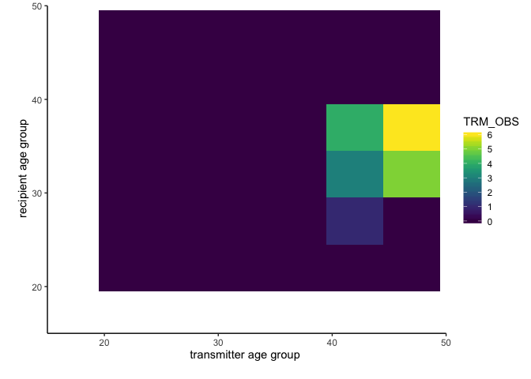
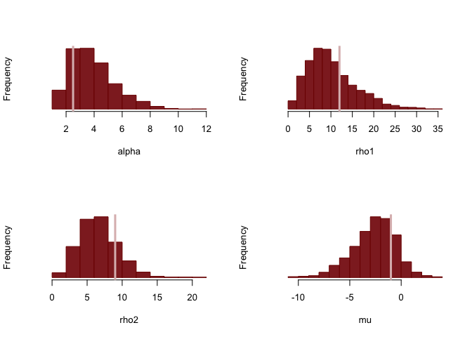

07 - Age analysis
================
2019-12-10

This vignette provides an extension of the general method of
**phyloflow**. The aim is to understand the transmission flows between
one-year increment age groups. The differences between this example with
the general pipeline of **phyloflow** is the correlation between flows.
To tackle this problem, we impose a Gaussian process prior on
transmission flows.

# Dataset

**We start with simulating transmission counts** between seven age
groups called “15-19”,“20-24”,“25-29”,“30-34”,“35-39”,“40-44”,“45-49”.
Note that in practice, it would be good to use this method to
investigate transmission dynamics between one-year increment age group,
as the squared exponential kernel is for the continuous input space.

``` r
library(rstan)
library(data.table)
library(ggplot2)
library(viridis)
set.seed(42)
rstan_options(auto_write = TRUE)
options(mc.cores = parallel::detectCores())

set.seed(42)
alpha_true <- c(2.5)
rho_true <- c(12,9)
mu_true <- -1
gp_dim <- 2
xi <- c(0.35, 0.45, 0.5, 0.55, 0.5, 0.55, 0.4)

dobs <- data.table(expand.grid(TR_TRM_CATEGORY = c("15-19","20-24","25-29","30-34","35-39","40-44","45-49"),
                               REC_TRM_CATEGORY = c("15-19","20-24","25-29","30-34","35-39","40-44","45-49")))

ds <- data.table(CATEGORY = c("15-19","20-24","25-29","30-34","35-39","40-44","45-49"),
                 P = xi,ID = 1:7)
setnames(ds,colnames(ds),paste0('TR_TRM_',colnames(ds)))
dobs <- merge(dobs,ds,by='TR_TRM_CATEGORY')
setnames(ds,colnames(ds),gsub('TR_','REC_',colnames(ds)))
dobs <- merge(dobs,ds,by='REC_TRM_CATEGORY')
setnames(ds,colnames(ds),gsub('REC_TRM_','',colnames(ds)))
dobs[,P:= TR_TRM_P * REC_TRM_P]
dobs[,TR_SMOOTH_CATEGORY:=as.numeric(substr(TR_TRM_CATEGORY,1,2))+2]
dobs[,REC_SMOOTH_CATEGORY:=as.numeric(substr(REC_TRM_CATEGORY,1,2))+2]
dobs[, TR_SAMPLING_CATEGORY:= TR_TRM_CATEGORY]
dobs[, REC_SAMPLING_CATEGORY:= REC_TRM_CATEGORY]

simu_pars <- list(  N=nrow(dobs), D=gp_dim, x=cbind(dobs$TR_SMOOTH_CATEGORY,dobs$REC_SMOOTH_CATEGORY),
                   alpha=alpha_true, rho=rho_true,
                   mu=mu_true,xi=dobs$P)
#   simulate data set   
simu_fit <- stan(   file="simu_poiss.stan", 
                  data=simu_pars, iter=1,
                  chains=1, seed=424838, algorithm="Fixed_param")
```

    ## 
    ## SAMPLING FOR MODEL 'simu_poiss' NOW (CHAIN 1).
    ## Chain 1: Iteration: 1 / 1 [100%]  (Sampling)
    ## Chain 1: 
    ## Chain 1:  Elapsed Time: 0 seconds (Warm-up)
    ## Chain 1:                5.1e-05 seconds (Sampling)
    ## Chain 1:                5.1e-05 seconds (Total)
    ## Chain 1:

``` r
dobs$TRM_OBS <- extract(simu_fit)$y[1,] 
```

# Input data: observed transmission flows

Input data of the similar format of **phyloflow** are
expected.

``` r
dobs <- subset(dobs, select = c('TR_TRM_CATEGORY', 'REC_TRM_CATEGORY','TR_SAMPLING_CATEGORY',
                                'REC_SAMPLING_CATEGORY', 'TR_SMOOTH_CATEGORY','REC_SMOOTH_CATEGORY',
                                'TRM_OBS'))
head(dobs)
```

    ##    TR_TRM_CATEGORY REC_TRM_CATEGORY TR_SAMPLING_CATEGORY REC_SAMPLING_CATEGORY
    ## 1:           15-19            15-19                15-19                 15-19
    ## 2:           20-24            15-19                20-24                 15-19
    ## 3:           25-29            15-19                25-29                 15-19
    ## 4:           30-34            15-19                30-34                 15-19
    ## 5:           35-39            15-19                35-39                 15-19
    ## 6:           40-44            15-19                40-44                 15-19
    ##    TR_SMOOTH_CATEGORY REC_SMOOTH_CATEGORY TRM_OBS
    ## 1:                 17                  17       0
    ## 2:                 22                  17       1
    ## 3:                 27                  17       0
    ## 4:                 32                  17       1
    ## 5:                 37                  17       0
    ## 6:                 42                  17       0

**`dobs` specifies observed counts of transmissions from a transmitter
age group to a recipient age group.** It must contain the following
columns:

  - *TR\_TRM\_CATEGORY* name of transmitter group.
  - *REC\_TRM\_CATEGORY* name of recipient group.
  - *TR\_SMOOTH\_CATEGORY* midpoint of transmitter age group.
  - *REC\_SMOOTH\_CATEGORY* midpoint of recipient age group.
  - *TRM\_CAT\_PAIR\_ID* identifier of transmitter-recipient pair
  - *TRM\_OBS* observed transmission counts

Let us look at the data. The first row shows zero counts of transmission
flows from age group “15-19” to age group “15-19”.

Here is a heatmap of our input data:

``` r
ggplot(dobs, aes(TR_SMOOTH_CATEGORY, REC_SMOOTH_CATEGORY))+
  geom_tile(aes(fill = TRM_OBS)) +
  scale_fill_viridis() +
  scale_x_continuous(expand = c(0,0), limits = c(14.5,49.5))+
  scale_y_continuous(expand = c(0,0), limits = c(14.5,49.5))+
  theme_classic()+
  labs(x='transmitter age group \n', y='\n recipient age group',fill='transmission \n counts')
```

<!-- -->

## Input data: sampling information

\*\* `dobs` also must contain information about how each group was
sampled. This is stored in the following columns:

  - *TR\_SAMPLING\_CATEGORY* sampling strata of transmitter group
  - *REC\_SAMPLING\_CATEGORY* sampling strata of recipient group

**`dprior.fit` specifies the distribution of probability of sampling an
individual from each sampling group.** This is either given by or
approximated by beta distribution in SARWS model or GLM model. This
information is stored in the following columns:

  - *SAMPLING\_CATEGORY* name of sampling strata
  - *ALPHA, BETA* shape parameters of the distribution of sampling
    probability.

Let us look at the sampling information:

``` r
ds$TRIAL <- c(4000, 3700, 3300, 2500, 1700, 1000, 500)
ds[,SUC := round(TRIAL * P)]
dprior.fit <- copy(ds)
dprior.fit[,ALPHA := SUC+1]
dprior.fit[,BETA := TRIAL-SUC+1]
dprior.fit
```

    ##    CATEGORY    P ID TRIAL  SUC ALPHA BETA
    ## 1:    15-19 0.35  1  4000 1400  1401 2601
    ## 2:    20-24 0.45  2  3700 1665  1666 2036
    ## 3:    25-29 0.50  3  3300 1650  1651 1651
    ## 4:    30-34 0.55  4  2500 1375  1376 1126
    ## 5:    35-39 0.50  5  1700  850   851  851
    ## 6:    40-44 0.55  6  1000  550   551  451
    ## 7:    45-49 0.40  7   500  200   201  301

# Method

We use **rstan** to sample from the posterior distribution \[
p(\lambda, s | n) \propto \prod_{i=1,\cdots,7;j=1,\cdots,7} Poisson(n_{ij};\lambda_{ij}*s_i*s_j) p(\lambda_{ij}) p(s_i) p(s_j).
\] Then, we calculate the main quantity of interest, \(\pi\), via \[
\pi_{ij}= \lambda_{ij} / \sum_{k=1,2; l=1,2} \lambda_{kl}.
\]

for \(i=1,,\cdots,7\) and \(j=1,,\cdots,7\).

# Independent Gamma prior

``` r
 tmp <- subset(ds,select = c('CATEGORY','ID'))
 setnames(tmp, colnames(tmp), paste0('TR_TRM_',colnames(tmp)))
 dobs <- merge(dobs,tmp,by='TR_TRM_CATEGORY')
 setnames(tmp, colnames(tmp), gsub('TR_TRM_','REC_TRM_',colnames(tmp)))
 dobs <- merge(dobs,tmp,by='REC_TRM_CATEGORY')
 setnames(tmp, colnames(tmp), gsub('REC_TRM_','',colnames(tmp)))
 
 
 data.gamma <- list(N=nrow(dobs),
                   Y=dobs$TRM_OBS,
                   N_xi = nrow(dprior.fit),
                   shape = cbind(dprior.fit$ALPHA,dprior.fit$BETA),
                   xi_id = cbind(dobs$TR_TRM_ID,dobs$REC_TRM_ID),
                   alpha = 0.8/nrow(dobs))
```

After preparing data, we could estimate flows under independent Gamma
prior.

``` r
  fit.gamma <- stan(file = 'gamma.stan',
              data = data.gamma,
              iter = 3000,  warmup = 500, chains=1, thin=1, seed = 42,
              algorithm = "NUTS", verbose = FALSE,
              control = list(adapt_delta = 0.8, max_treedepth=10))
```

    ## 
    ## SAMPLING FOR MODEL 'gamma' NOW (CHAIN 1).
    ## Chain 1: 
    ## Chain 1: Gradient evaluation took 6.6e-05 seconds
    ## Chain 1: 1000 transitions using 10 leapfrog steps per transition would take 0.66 seconds.
    ## Chain 1: Adjust your expectations accordingly!
    ## Chain 1: 
    ## Chain 1: 
    ## Chain 1: Iteration:    1 / 3000 [  0%]  (Warmup)
    ## Chain 1: Iteration:  300 / 3000 [ 10%]  (Warmup)
    ## Chain 1: Iteration:  501 / 3000 [ 16%]  (Sampling)
    ## Chain 1: Iteration:  800 / 3000 [ 26%]  (Sampling)
    ## Chain 1: Iteration: 1100 / 3000 [ 36%]  (Sampling)
    ## Chain 1: Iteration: 1400 / 3000 [ 46%]  (Sampling)
    ## Chain 1: Iteration: 1700 / 3000 [ 56%]  (Sampling)
    ## Chain 1: Iteration: 2000 / 3000 [ 66%]  (Sampling)
    ## Chain 1: Iteration: 2300 / 3000 [ 76%]  (Sampling)
    ## Chain 1: Iteration: 2600 / 3000 [ 86%]  (Sampling)
    ## Chain 1: Iteration: 2900 / 3000 [ 96%]  (Sampling)
    ## Chain 1: Iteration: 3000 / 3000 [100%]  (Sampling)
    ## Chain 1: 
    ## Chain 1:  Elapsed Time: 7.2269 seconds (Warm-up)
    ## Chain 1:                18.8831 seconds (Sampling)
    ## Chain 1:                26.11 seconds (Total)
    ## Chain 1:

``` r
  M <- 30
  D <- 2 
  indices <- matrix(NA, M^D, D)
  mm=0;
  for (m1 in 1:M){
    for (m2 in 1:M){
      mm = mm+1
      indices[mm,] = c(m1, m2)
    }
  }
  
 

  data.gp <- list( M= M, M_nD= M^D, 
                         L= c(3/2*max(dobs$TR_SMOOTH_CATEGORY),3/2*max(dobs$REC_SMOOTH_CATEGORY)), 
                         N = nrow(dobs),
                         x = cbind(dobs$TR_SMOOTH_CATEGORY,dobs$REC_SMOOTH_CATEGORY),
                         D = D,
                         y = dobs$TRM_OBS,
                         indices= indices,
                         N_xi = nrow(ds),
                         shape = cbind(dprior.fit$ALPHA,dprior.fit$BETA),
                         xi_id = cbind(dobs$TR_TRM_ID,dobs$REC_TRM_ID))
```

After preparing data, we could estimate flows under independent Gaussian
process prior.

``` r
 fit.gp <- stan(file = 'gp.stan',
            data = data.gp,
            iter = 3000,  warmup = 500, chains=1, thin=1, seed = 42,
            algorithm = "NUTS", verbose = FALSE,
            control = list(adapt_delta = 0.8, max_treedepth=10))
```

    ## 
    ## SAMPLING FOR MODEL 'gp' NOW (CHAIN 1).
    ## Chain 1: 
    ## Chain 1: Gradient evaluation took 0.002662 seconds
    ## Chain 1: 1000 transitions using 10 leapfrog steps per transition would take 26.62 seconds.
    ## Chain 1: Adjust your expectations accordingly!
    ## Chain 1: 
    ## Chain 1: 
    ## Chain 1: Iteration:    1 / 3000 [  0%]  (Warmup)
    ## Chain 1: Iteration:  300 / 3000 [ 10%]  (Warmup)
    ## Chain 1: Iteration:  501 / 3000 [ 16%]  (Sampling)
    ## Chain 1: Iteration:  800 / 3000 [ 26%]  (Sampling)
    ## Chain 1: Iteration: 1100 / 3000 [ 36%]  (Sampling)
    ## Chain 1: Iteration: 1400 / 3000 [ 46%]  (Sampling)
    ## Chain 1: Iteration: 1700 / 3000 [ 56%]  (Sampling)
    ## Chain 1: Iteration: 2000 / 3000 [ 66%]  (Sampling)
    ## Chain 1: Iteration: 2300 / 3000 [ 76%]  (Sampling)
    ## Chain 1: Iteration: 2600 / 3000 [ 86%]  (Sampling)
    ## Chain 1: Iteration: 2900 / 3000 [ 96%]  (Sampling)
    ## Chain 1: Iteration: 3000 / 3000 [100%]  (Sampling)
    ## Chain 1: 
    ## Chain 1:  Elapsed Time: 93.4892 seconds (Warm-up)
    ## Chain 1:                209.712 seconds (Sampling)
    ## Chain 1:                303.201 seconds (Total)
    ## Chain 1:

Finally, we checked the effective sample size and Rhat for the Gamma
fit.

``` r
range(summary(fit.gamma)$summary[, "n_eff"])
```

    ## [1]  528.7714 3199.4158

``` r
range(summary(fit.gamma)$summary[, "Rhat"])
```

    ## [1] 0.9995999 1.0017399

``` r
params_gamma <- extract(fit.gamma)
```

Finally, we checked the effective sample size and Rhat for the GP fit.

``` r
range(summary(fit.gp)$summary[, "n_eff"])
```

    ## [1]  276.4037 4002.5037

``` r
range(summary(fit.gp)$summary[, "Rhat"])
```

    ## [1] 0.9995999 1.0135090

``` r
params_gp <- extract(fit.gp)
```

The histograms of hyperparameters are plotted in order to compare with
true hyperparameter values under GP prior.

``` r
c_light <- c("#DCBCBC")
c_dark <- c("#8F2727")
c_dark_highlight <- c("#7C0000")
par(mfrow=c(2, 2))  
hist(params_gp$alpha, main="", xlab="alpha", col=c_dark, border=c_dark_highlight, yaxt='n')
abline(v=2.5, col=c_light, lty=1, lwd=3)
hist(params_gp$rho[,1], main="", xlab="rho1", col=c_dark, border=c_dark_highlight, yaxt='n')
abline(v=12, col=c_light, lty=1, lwd=3)
hist(params_gp$rho[,2], main="", xlab="rho2", col=c_dark, border=c_dark_highlight, yaxt='n')
abline(v=9, col=c_light, lty=1, lwd=3)
hist(params_gp$mu, main="", xlab="mu", col=c_dark, border=c_dark_highlight, yaxt='n')
abline(v=-1, col=c_light, lty=1, lwd=3)
```

<!-- -->
