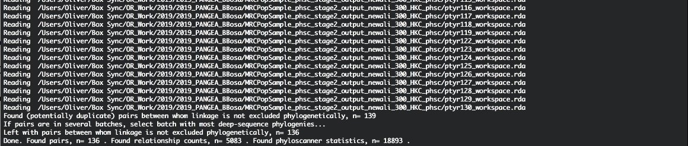
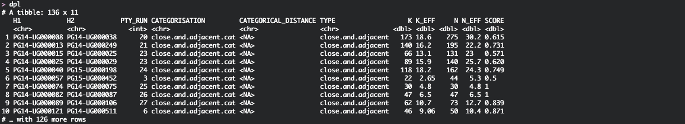
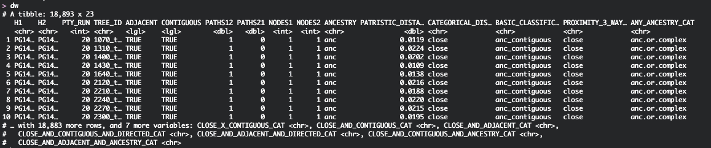
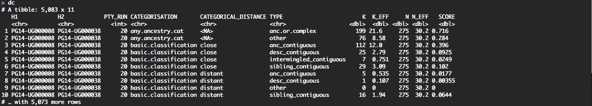
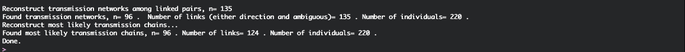
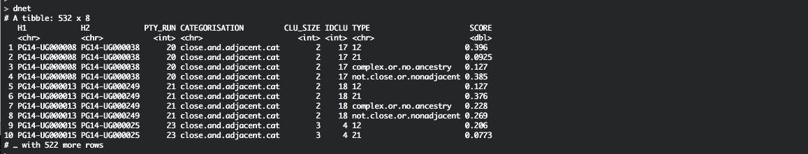
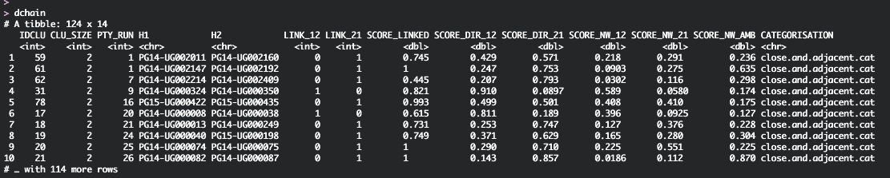

```{r setup, echo=FALSE, include = FALSE}
knitr::opts_chunk$set(
  collapse = TRUE,
  tidy.opts=list(width.cutoff=80),
  tidy=TRUE,
  fig.pos= "h",
  comment = "#>"
)
``` 
```{r, include=TRUE, eval=TRUE, echo=FALSE, tidy=TRUE, results='hide',message=FALSE, warning=FALSE}
require(knitr)
require(kableExtra)
```

## Introduction
In this vignette, we describe how transmission networks can be
reconstructed from *phyloscanner* output with the R package `phyloscannerR`.

This will involve the following steps:

1. Find pairs of individuals between whom phylogenetic linkage cannot be
   excluded based on the distance and topological relationship of viral reads
   from both individuals. This will use output from a previous *phyloscanner*
   analysis.
2. Inspect the *phyloscanner* statistics for each deep-sequence tree for these
   pairs.
3. Inspect the *phyloscanner* relationship counts across all deep-sequence
   tree for these pairs.
4. Reconstruct distinct transmission networks between these pairs, and
   reconstruct the most likely transmission chain for each network. 
5. Plot the transmission networks and the transmission chains.
   
We will introduce the following functions from the `phyloscannerR` package:

* `find.pairs.in.networks`
* `produce.pairwise.graphs2`
* `find.networks`
* `plot.network`
* `plot.chain`     
    
## Data    
The data that we will be using in this vignette is from the MRC UVRI cohort in
south-eastern Uganda, and was generated by the PANGEA consortium.
    
## Getting started
We assume that output from a previous *phyloscanner* analysis is available,
containing files that end in `*workspace.rda`. We will need only these files to
reconstruct the transmission networks. Let us get started. 

```{r, include=TRUE, eval=FALSE, echo=TRUE}
# 	load packages
require(tidyverse)
require(RBGL)
require(igraph)
require(network)
require(ggnet)
require(phyloscannerR)

#	directory with phyloscanner output containing the *workspace.rda file
home <- '/Users/Oliver/Box Sync/OR_Work/2019/2019_PANGEA_BBosa'
indir <- file.path(home,'MRCPopSample_phsc_stage2_output_newali_300_HKC_phsc')

#	output files
outdir <- file.path(home, 'MRCPopSample_phsc_stage2_output_newali_300_HKC_analysis')
file.pairs <- file.path(outdir, 'MRCUVRI_phscallpairs_190827.rda')
file.nets <- file.path(outdir, 'MRCUVRI_phscnetworks_190827.rda')		
```

## Pairs of individuals between whom linkage is not excluded 
We will now processes the *phyloscanner* output in `indir`. We will use the
*phyloscanner* specification as used for [the
Rakai analysis](https://www.nature.com/articles/s41467-019-09139-4). The next
lines of code specify a list of `control` options, and then use function
`find.pairs.in.networks`.

```{r, include=TRUE, eval=FALSE, echo=TRUE, tidy=FALSE, results='hide'}
#	control options
#
#	phyloscanner produces several different phylogenetic classifications
#	schemes; for example by phylogenetic distance only; or using phylogenetic
#	distance and topologic adjacency (`close.and.adjacent.cat`); or phylogenetic
#	distance and topologic contiguity. We select one of them.
#
control <- list(	linked.group='close.and.adjacent.cat',
#	( use classification based on phylogenetic distance and topological adjacency )		
					linked.no='not.close.or.nonadjacent',
#	( pairs are interpreted to be unlinked 
#	  if classified as 'not.close.or.nonadjacent' )		
					linked.yes='close.and.adjacent',
#	( pairs are interpreted to be linked 
#	  if classified as 'close.or.nonadjacent' ) 		
					conf.cut=0.6, 
#	( threshold on the proportion of deep-sequence phylogenies
#	  pairs unlinked in more than this are discarded )		
					neff.cut=3
#	( threshold on the effective number of deep-sequence phylogenies
#	  pairs with fewer data are discarded )			
					)
										
tmp <- find.pairs.in.networks(	indir, 
								batch.regex='^ptyr([0-9]+)_.*', 
#	( batch.regex identifies the batch number from the
#     file names of *phyloscanner* output. Typically, this batch number corresponds
#     to the analysis of a particular transmission network. )								
								control=control, 
								verbose=TRUE)
						
dpl <- copy(tmp$network.pairs) 	
#	the pairs
dc <- copy(tmp$relationship.counts) 
#	their relationship counts summed over phylogenies
dw <- copy(tmp$windows)	
#	their relationship stats for all phylogenies

#save(dpl, dc, dw, file=file.pairs)
```

<!--
The above should produce the following output or similar (when
`verbose=TRUE`): ```{r, out.width="\\linewidth", include=TRUE, fig.align="center", echo=FALSE}

```
-->

## Output of `find.pairs.in.networks`

Let us have a look at the selected pairs:
```{r, out.width="\\linewidth", include=TRUE, fig.align="center", echo=FALSE}

```

Here,

1. Columns `H1` and `H2` list the individual ID of the individuals between whom
   linkage is not rejected.
2. Column `PTY_RUN` lists the batch number of the phyloscanner analysis
   specified through `batch.regex`.
3. Column `NEFF` gives the total number of deep-sequence phylogenies for the
   pair, and `KEFF` gives the total number of phylogenies in which the two
   individuals have virus that is `close.and.adjacent`.
   
Now let us have a look at the relationship stats for all phylogenies:   
```{r, out.width="\\linewidth", include=TRUE, fig.align="center", echo=FALSE}

```

Here,

1. Columns `H1`, `H2` and `PTY_RUN` are as before.
2. Column `TREE_ID` gives the identifier of the phylogeny for which the
   *phyloscanner* statistics are evaluated.
3. Columns `ADJACENT`, `CONTIGUOUS`, `PATHS12`, `PATHS21`, `ANCESTRY`,
   `PATRISTIC_DISTANCE` give the basic *phyloscanner* statistics that describe
   the relationship of virus from two individuals in this phylogeny.
4. The remaining columns list all the different classification schemes that
   *phyloscanner* produces by default (e.g. `PROXIMITY-3_WAY_CAT`), and the
   classifications in rows (e.g. `close`).

Now let us have a look at the relationship counts summed over all
phylogenies:   
```{r, out.width="\\linewidth", include=TRUE, fig.align="center", echo=FALSE}

```

Here,

1. Columns `H1`, `H2` and `PTY_RUN` are as before.
2. Column `CATEGORISATION` then lists one of the classification schemes and
   column `TYPE` all of the classifications in this scheme.
3. For each classification, `NEFF` gives the total number of deep-sequence
   phylogenies for the pair, and `KEFF` gives the total number of phylogenies in
   which the two individuals have that classification. 

## Plotting the phylogenetic relationships between pairs of individuals
At this point, we can easily visualise the phylogenetic relationships between
two individuals across the genome. We call these plots phyloscans:
```{r, include=TRUE, eval=FALSE, echo=TRUE, tidy=TRUE}
# plot phyloscans of all likely pairs
hosts <- dw %>% select(H1, H2) %>% 
		gather('HOST_TYPE','H') %>% 
		select(-HOST_TYPE) %>%
		distinct() %>%
		arrange(H) %>%
		pull(H)
# plot phyloscans of one pair
hosts <- dw[1,]  %>% select(H1, H2) %>% 
		gather('HOST_TYPE','H') %>% 
		select(-HOST_TYPE) %>% 
		pull(H)
tmp <- copy(dw)
tmp	<- produce.pairwise.graphs2(NULL, hosts=hosts, dwin=tmp, inclusion = "both")
tmp$graph
```    
```{r, out.width="\\linewidth", include=TRUE, fig.align="center", echo=FALSE, out.width = "100%"}
knitr::include_graphics("UVRI.03.reconstruct_transmission_networks_phyloscan.pdf")
```


## Reconstructing transmission networks
We can now reconstruct transmission networks, which are defined as sets of
individuals between whom phylogenetic linkage is not excluded. Between any two
individuals in a network, there are three weighted edges that describe the
phylogenetic support for transmission in the one direction, in the other
direction, and support for phylogenetic linkage without evidence for
directionality.

The same function also reconstructs the most likely transmission chain for each
network. A transmission chain is defined as the directed graph with nodes of
indegree 1 and arbitrary outdegree that connects all individuals and has the
largest product of edge weights. Full details are given in the [the Rakai
paper](https://www.nature.com/articles/s41467-019-09139-4).

Finally, from the transmission chains it is straightforward to extract highly
supported pairs. 

Here is the code:
```{r, include=TRUE, eval=FALSE, echo=TRUE, tidy=FALSE, results='hide'}
#	construct networks between pairs using the same 
#	control options as before
tmp <- find.networks(dc, control=control, verbose=TRUE)
#	extract networks and the transmission chains within them
dnet <- copy(tmp$transmission.networks)
dchain <- copy(tmp$most.likely.transmission.chains)

#	construct highly supported pairs
conf.cut <- 0.6
dconfpairs <- dchain %>% 
		filter( SCORE_LINKED>conf.cut & 
				pmax(SCORE_DIR_12, SCORE_DIR_21)>conf.cut) %>%
		select(-c(SCORE_NW_12, SCORE_NW_12, SCORE_NW_AMB))

#	save
#save(dpl, dc, dw, dnet, dchain, dconfpairs, file=file.nets)
```

<!-- 
The above should produce the following output or similar (when `verbose=TRUE`):
```{r, out.width="\\linewidth", include=TRUE, fig.align="center", echo=FALSE}

```
-->

## Output from reconstructing transmission networks
Let us have a look at the transmission networks:
```{r, out.width="\\linewidth", include=TRUE, fig.align="center", echo=FALSE}

```

Here,

1. Columns `H1` and `H2` list as before the individual ID of the individuals
   between whom linkage is not rejected.
2. Column `PTY_RUN` lists as before the batch number of the phyloscanner
   analysis specified through `batch.regex`.
3. Column `IDCLU` gives an identifier for each reconstructed transmission
   network.
4. Column `TYPE` gives the possible classifications of the phylogenetic
   relationship types between the individuals. Using the default options in
   `control`, this is evidence for transmission in either direction (`12` and
   `21`), support for phylogenetic linkage without evidence for directionality
   (`complex.or.no.ancestry`), and evidence for no phylogenetic linkage
   (`not.close.or.nonadjacent`). 
5. Column `SCORE` gives the *phyloscanner* score for each classification, which
   is defined by `KEFF` divided by `NEFF`.
   

Let us plot one of these networks. The code to do this is as follows:   

```{r, include=TRUE, eval=FALSE, echo=TRUE, tidy=FALSE, fig.align="center"}
# plot all networks
idclus <- sort(unique(dnet$IDCLU))
# find IDs of all networks
control<- list()
control$point.size = 10
control$edge.gap = 0.04
control$edge.size = 2
control$curvature = -0.2
control$arrow = arrow(length = unit(0.04, "npc"), type = "open")
control$curv.shift = 0.06
control$label.size = 3
# the above options may need to be changed, depending on the 
# size of the networks and the size of your pdf output
control$node.label = "H" 
# specify the column in 'di' below that should be used as nodel label
control$node.fill = NA_character_
control$node.fill.values = c(`NA` = "steelblue2")
# specify the background colour for each node
control$node.shape = NA_character_
control$node.shape.values = c(`NA` = 16)
# specify the shape for each node
control$threshold.linked = 0.6
# edges will be highlighted in darkgrey if 'SCORE_LINKED' is above this threshold 
pns		<- lapply(seq_along(idclus), function(i)
		{
			idclu <- idclus[i]
			df <- dnet %>% 
					filter(IDCLU == idclu)
			di <- df %>% 
					select(H1, H2) %>% 
					gather('HOST_TYPE','H') %>% 
					select(-HOST_TYPE) %>%
					distinct() 				
			p <- plot.network(df, di, control)					
			p	
		})
pns[[10]]
```
```{r, out.width="\\linewidth", include=TRUE, fig.align="center", echo=FALSE, out.width = "80%"}
knitr::include_graphics("UVRI.03.reconstruct_transmission_networks_dnetplot.pdf")
```  

## Output from reconstructing transmission chains   
Now, let us have a look at the corresponding transmission chains:
```{r, out.width="\\linewidth", include=TRUE, fig.align="center", echo=FALSE}

```

Here,

1. Columns `H1`, `H2`, `PTY_RUN` and `IDCLU` are as before.
2. Column `LINK_12` states if there is a directed edge from `H1` to `H2` in the
   most likely transmission chain, and `LINK_21` states if there is a directed
   edge in the other direction.
3. Column `SCORE_LINKED` gives the *phyloscanner* score for phylogenetic
   linkage. Using the default options, this is the sum of `KEFF` for `12`, `21`
   and `complex.or.no.ancestry`, divided by `NEFF`.
4. Column `SCORE_DIR_12` gives the *phyloscanner* score for transmission
   direction `H1` to `H2` among phylogenies supporting phylogenetic linkage.
   Column `SCORE_DIR_21` gives the *phyloscanner* score for transmission in the
   opposite direction.
  
We can also plot the transmission chains. The code to do this is as follows:

```{r, include=TRUE, eval=FALSE, echo=TRUE, tidy=FALSE}
# plot corresponding most likely chains	
pcs		<- lapply(seq_along(idclus), function(i)
		{
			idclu <- idclus[i]
			control$layout <- pns[[i]][['layout']] 
			df <- dchain %>% 
					filter(IDCLU == idclu)
			di <- df %>% 
					select(H1, H2) %>% 
					gather('HOST_TYPE','H') %>% 
					select(-HOST_TYPE) %>%
					distinct() 
			p <- plot.chain(df, di, control)					
			p	
		})
pcs[[10]]
```  
```{r, out.width="\\linewidth", include=TRUE, fig.align="center", echo=FALSE, out.width = "80%"}
knitr::include_graphics("UVRI.03.reconstruct_transmission_networks_dchainplot.pdf")
```  

  
## Final notes
  
1. It is also easy to add any further individual-level meta-data to the analysis
   output. Specify the `dmeta` input variable `find.pairs.in.networks`. 
	